High-performance block storage is a critical requirement for modern cloud-native workloads — databases, virtual machines, and containerised applications all demand low-latency, high-throughput access to persistent volumes. Ceph now supports **NVMe over Fabrics (NVMe-oF)** with a **TCP transport**, enabling clients to access Ceph RADOS Block Device (RBD) images as NVMe namespaces over a standard IP network — without specialised hardware.

This blog post walks through how to configure and manage NVMe/TCP in Ceph using the **Ceph Dashboard**, covering the complete lifecycle: deploying the `nvmeof` service, creating and managing **Gateway Groups**, exploring the gateway detail view, and understanding the **Subsystems** and **Namespaces** tabs that complete the NVMe-oF setup.

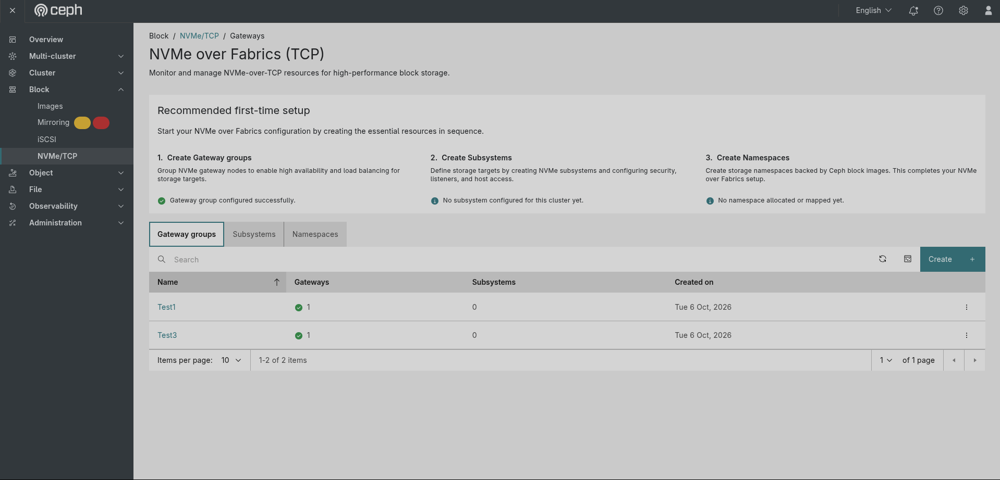
_Figure: The **Block → NVMe/TCP → Gateways** landing page, showing the recommended first-time setup sequence and two existing gateway groups (Test1, Test3)._

## Overview: The Three-Step Setup Sequence

When you navigate to **Block → NVMe/TCP** in the Ceph Dashboard, the page opens on the **Gateway groups** tab and displays a **Recommended first-time setup** banner that guides you through the three sequential steps required to get NVMe-oF working:

| Step                         | Action                                                                                                   | Status                                          |
| ---------------------------- | -------------------------------------------------------------------------------------------------------- | ----------------------------------------------- |
| **1. Create Gateway groups** | Group NVMe gateway nodes to enable high availability and load balancing for storage targets.             | ✅ Gateway group configured successfully.       |
| **2. Create Subsystems**     | Define storage targets by creating NVMe subsystems and configuring security, listeners, and host access. | ℹ No subsystem configured for this cluster yet. |
| **3. Create Namespaces**     | Create storage namespaces backed by Ceph block images. This completes your NVMe over Fabrics setup.      | ℹ No namespace allocated or mapped yet.         |

The banner updates its status indicators as you complete each step, making it easy to track progress. The page also exposes three tabs — **Gateway groups**, **Subsystems**, and **Namespaces** — which are the main management surfaces throughout this guide.

## Prerequisites: Deploying the NVMe-oF Service

Before creating gateway groups in the Dashboard, the `nvmeof` orchestrator service must be running on at least one Ceph node. You can deploy it via **Administration → Services → Create service** in the Dashboard, or using `cephadm` from the CLI.

### Creating the Service from the Dashboard

Navigate to **Administration → Services** and click **Create**. In the **Create service** dialog:

- **Type** — select `nvmeof` from the dropdown.
- **Group name** — the name of the gateway group this service instance belongs to (e.g., `default`).
- **Service name** — auto-populated as `nvmeof.<group-name>` (e.g., `nvmeof.default`).
- **Unmanaged** — leave unchecked so the orchestrator manages the service lifecycle.
- **Placement** — choose `Hosts` to target specific nodes.
- **Hosts** — filter and select the host(s) where the gateway daemon should run.
- **Encryption** — optionally enable mutual TLS (mTLS) between client and gateway server.

Click **Create service** to deploy the daemon. Once it is running, the gateway node becomes available for selection when creating a gateway group.

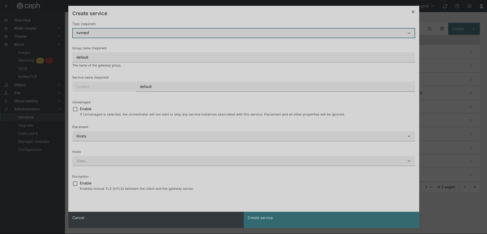
_Figure: The **Create service** dialog with Type set to `nvmeof`, Group name `default`, and Placement set to `Hosts`._

---

## 1. Gateway Groups

### 1.1 The Gateway Group List

The **Gateway groups** tab lists all existing gateway groups. Each row shows:

| Column         | Description                                                                                            |
| -------------- | ------------------------------------------------------------------------------------------------------ |
| **Name**       | The unique name of the gateway group (e.g., `Test1`, `Test3`). Click the name to open the detail view. |
| **Gateways**   | The number of gateway nodes in the group, with a green check indicating all nodes are healthy.         |
| **Subsystems** | The number of NVMe subsystems currently attached to this group.                                        |
| **Created on** | The date the gateway group was created.                                                                |

The **⋮** action menu at the end of each row provides **Edit** and **Delete** options.

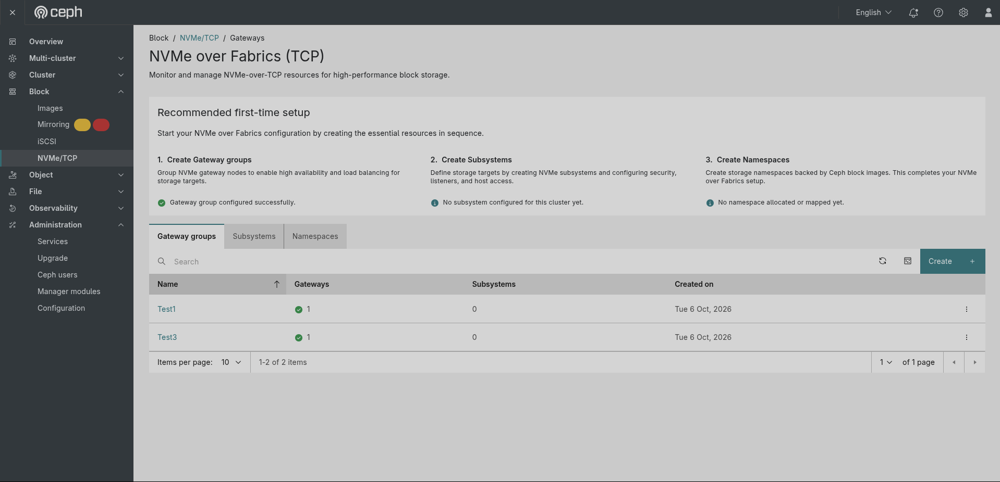
_Figure: The Gateway groups tab listing two groups (Test1, Test3), each with 1 healthy gateway node and 0 subsystems, created on Tue 6 Oct, 2026._

### 1.2 Creating a Gateway Group

Click the **Create** button in the top-right corner of the Gateway groups tab. This opens the **Create Gateway Group** page — a logical group of NVMe gateways that hosts connect to for load-balanced access.

#### Step 1 — Gateway Group Name, Target Nodes and Encryption

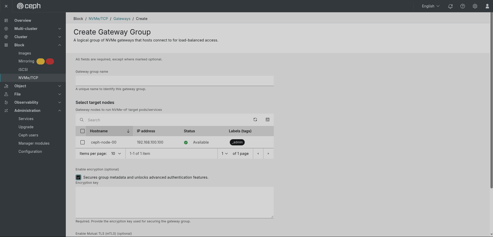
_Figure: The Create Gateway Group form — Gateway group name field, Select target nodes table (ceph-node-00, 192.168.100.100, Available, \_admin), Enable encryption checkbox checked, and the Encryption key text area with the hint "Required. Provide the encryption key used for securing the gateway group."_

Fill in the following fields:

- **Gateway group name** — a unique name to identify this gateway group (e.g., `Test1`). The hint text reads _"A unique name to identify this gateway group."_

**Select target nodes** — the table lists all available Ceph nodes that can run NVMe-oF target pods/services. Check one or more nodes to include them in the group:

| Column            | Description                                                                           |
| ----------------- | ------------------------------------------------------------------------------------- |
| **Hostname**      | The Ceph node hostname (e.g., `ceph-node-00`).                                        |
| **IP address**    | The node's IP address (e.g., `192.168.100.100`).                                      |
| **Status**        | Node availability — **Available** (green) means the node is ready to run the gateway. |
| **Labels (tags)** | Any cephadm labels applied to the node (e.g., `_admin`).                              |

**Enable encryption (optional)** — checking _"Secures group metadata and unlocks advanced authentication features"_ enables encryption for this gateway group. When the checkbox is ticked, an **Encryption key** text area appears immediately below it. The field hint reads _"Required. Provide the encryption key used for securing the gateway group."_ — paste or type the encryption key here. This field becomes required as soon as encryption is enabled.

#### Step 2 — Encryption Key, mTLS, and Certificate Authority (Internal)

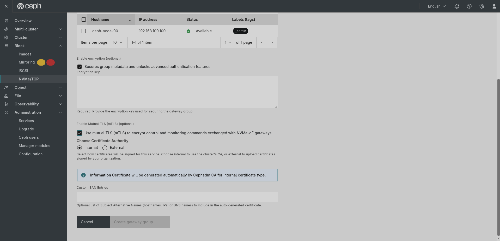
_Figure: The Create Gateway Group form scrolled down — the node table (ceph-node-00, unchecked) at the top, Enable encryption checkbox checked with the Encryption key text area below it (hint: "Required. Provide the encryption key used for securing the gateway group."), Enable Mutual TLS checkbox checked, **Internal** Certificate Authority radio selected, the "Certificate will be generated automatically by Cephadm CA for internal certificate type." information banner, Custom SAN Entries field, and the greyed-out **Create gateway group** button._

**Enable Mutual TLS (mTLS) (optional)** — checking _"Use mutual TLS (mTLS) to encrypt control and monitoring commands exchanged with NVMe-oF gateways"_ enables mTLS. When enabled, the **Choose Certificate Authority** radio buttons appear:

- **Internal** _(default)_ — the certificate is generated automatically by the Cephadm CA. A blue information banner confirms: _"Certificate will be generated automatically by Cephadm CA for internal certificate type."_ The hint below the CA selection reads: _"Select how certificates will be signed for this service. Choose internal to use the cluster's CA, or external to upload certificates signed by your organization."_ You can optionally provide **Custom SAN Entries** — an optional list of Subject Alternative Names (hostnames, IPs, or DNS names) to include in the auto-generated certificate. The hint reads _"Optional list of Subject Alternative Names (hostnames, IPs, or DNS names) to include in the auto-generated certificate."_
- **External** — upload your own organisation-signed certificates (see Step 3 below).

Once all fields are filled, click **Create gateway group** to create the group. The button remains greyed out until all required fields are valid.

#### Step 3 — mTLS with External Certificate Authority

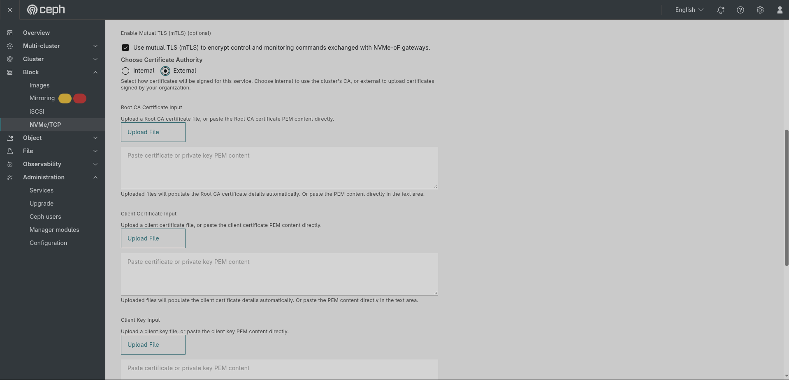
_Figure: mTLS with **External** CA selected — Enable Mutual TLS checkbox checked, **External** radio selected, Root CA Certificate Input (Upload File + PEM paste area, hint: "Uploaded files will populate the Root CA certificate details automatically. Or paste the PEM content directly in the text area."), Client Certificate Input (Upload File + PEM paste area), and Client Key Input (Upload File + PEM paste area, hint: "Upload a client key file, or paste the client key PEM content directly.")._

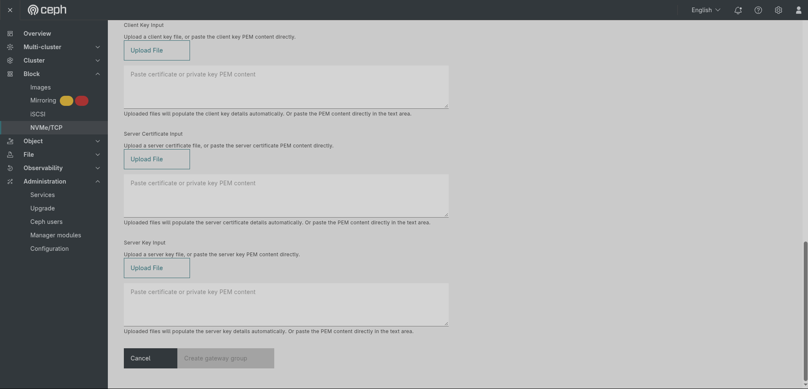
_Figure: mTLS External CA continued — Client Key Input paste area at top, Server Certificate Input (Upload File + PEM paste area, hint: "Uploaded files will populate the server certificate details automatically."), Server Key Input (Upload File + PEM paste area), and the **Cancel** / **Create gateway group** buttons at the bottom._

When **External** is selected as the Certificate Authority, the form expands to show five certificate and key upload fields, appearing in this order. Each accepts either a file upload via **Upload File** or PEM content pasted directly into the text area:

| Field                         | Description                                                                                                                                      |
| ----------------------------- | ------------------------------------------------------------------------------------------------------------------------------------------------ |
| **Root CA Certificate Input** | Upload or paste the Root CA certificate PEM. Hint: _"Upload a Root CA certificate file, or paste the Root CA certificate PEM content directly."_ |
| **Client Certificate Input**  | Upload or paste the client certificate PEM. Hint: _"Upload a client certificate file, or paste the client certificate PEM content directly."_    |
| **Client Key Input**          | Upload or paste the private key for the client certificate. Hint: _"Upload a client key file, or paste the client key PEM content directly."_    |
| **Server Certificate Input**  | Upload or paste the server certificate PEM. Hint: _"Upload a server certificate file, or paste the server certificate PEM content directly."_    |
| **Server Key Input**          | Upload or paste the private key for the server certificate. Hint: _"Upload a server key file, or paste the server key PEM content directly."_    |

Click **Create gateway group** at the bottom of the form to save. Click **Cancel** to discard without saving.

---

### 1.3 Gateway Group Detail View

Clicking a gateway group name (e.g., `Test3`) opens its **detail view**, which has two tabs in the left sidebar: **Overview** and **Subsystems**.

#### Overview Tab

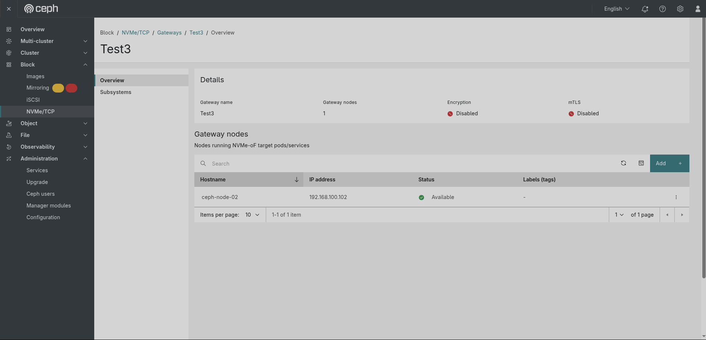
_Figure: The **Test3** gateway group detail view — Overview tab showing Details (Gateway name, Gateway nodes count, Encryption: Disabled, mTLS: Disabled) and the Gateway nodes table with `ceph-node-02` at `192.168.100.102`._

The **Details** section at the top of the Overview tab shows four key properties:

| Property          | Description                                                                                              |
| ----------------- | -------------------------------------------------------------------------------------------------------- |
| **Gateway name**  | The name of the gateway group (e.g., `Test3`).                                                           |
| **Gateway nodes** | The total number of nodes running NVMe-oF target services in this group (e.g., `1`).                     |
| **Encryption**    | Whether group-level encryption is enabled. A red ● **Disabled** indicates it is off.                     |
| **mTLS**          | Whether mutual TLS is active for control-plane communications. A red ● **Disabled** indicates it is off. |

The **Gateway nodes** table below lists every node assigned to this group:

| Column            | Description                                                                                 |
| ----------------- | ------------------------------------------------------------------------------------------- |
| **Hostname**      | The node's hostname (e.g., `ceph-node-02`).                                                 |
| **IP address**    | The node's IP (e.g., `192.168.100.102`).                                                    |
| **Status**        | Live health of the gateway daemon — green ● **Available** means the SPDK target is running. |
| **Labels (tags)** | Any cephadm labels on the node (`-` if none).                                               |

An **Add** button in the top-right corner of the Gateway nodes table lets you expand the group by adding more nodes without recreating it.

##### Adding Gateway Nodes

Click **Add** to open the **Add gateway nodes** dialog — _"Select NVMe-oF gateway nodes to associate with this gateway group."_

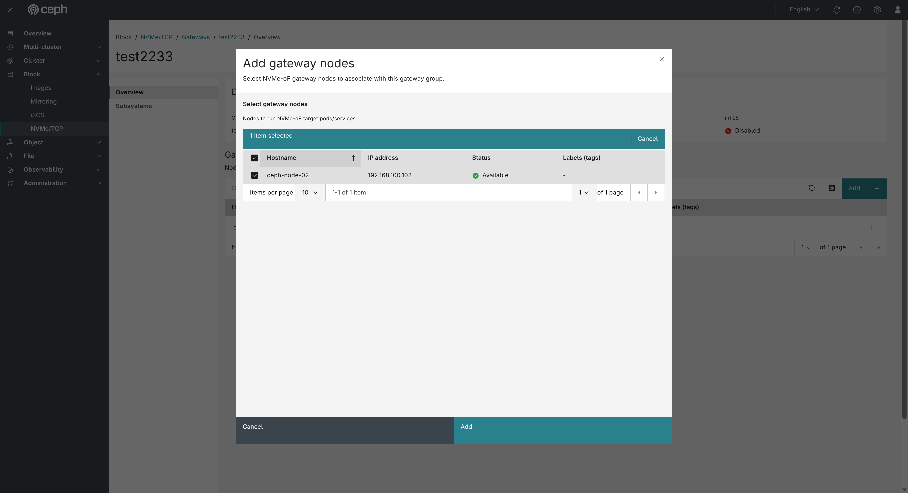
_Figure: The **Add gateway nodes** dialog for gateway group `test2233` — Select gateway nodes table with `ceph-node-02` (`192.168.100.102`, Available) selected. **Add** is enabled; **Cancel** closes without changes._

The dialog shows a **Select gateway nodes** table of hosts that can run NVMe-oF target pods/services:

| Column            | Description                                                     |
| ----------------- | --------------------------------------------------------------- |
| **Hostname**      | Ceph node hostname (e.g., `ceph-node-02`).                      |
| **IP address**    | Node IP address (e.g., `192.168.100.102`).                      |
| **Status**        | Availability — green **Available** means the node can be added. |
| **Labels (tags)** | Any cephadm labels on the node.                                 |

Select one or more available nodes, then click **Add**. A success notification appears (e.g. _"Added hosts to gateway group 'test2233'"_), and the new nodes show up in the Gateway nodes table. Click **Cancel** to close without adding anything.

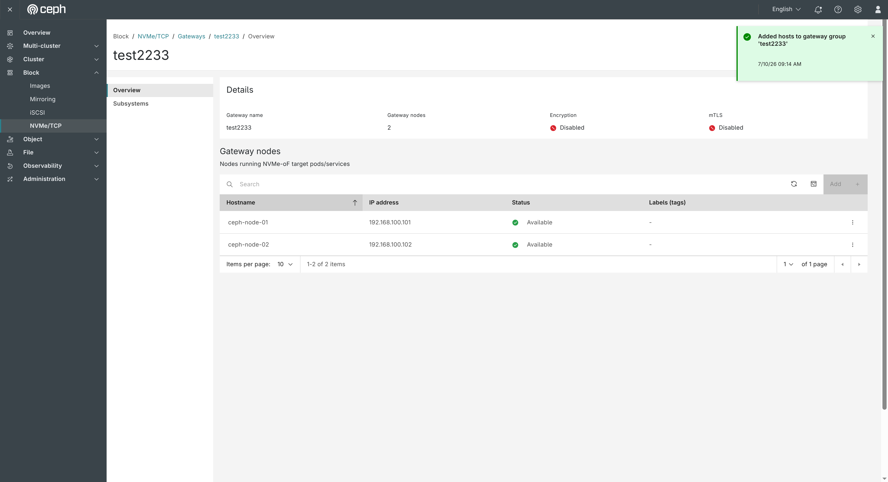
_Figure: Gateway group `test2233` Overview after adding a node — Details shows **Gateway nodes: 2**, success toast _"Added hosts to gateway group 'test2233'"_, and the Gateway nodes table lists `ceph-node-01` and `ceph-node-02`, both **Available**._

**What happens when you add nodes:** the Dashboard updates the `nvmeof.<group-name>` service placement to include the selected hosts. Cephadm then deploys NVMe-oF gateway daemons on those nodes. Once they are healthy, they appear in the Gateway nodes table and can serve listeners/traffic for subsystems in this group. Adding a second (or more) gateway is what enables high availability — a group with only one gateway cannot provide HA. This step does not create subsystems or namespaces; it only expands the gateway capacity of the group.

**Note:** Only nodes that are not already members of this gateway group (and are available for NVMe-oF) are listed. If every suitable host is already in the group, the table may be empty.

#### Subsystems Tab

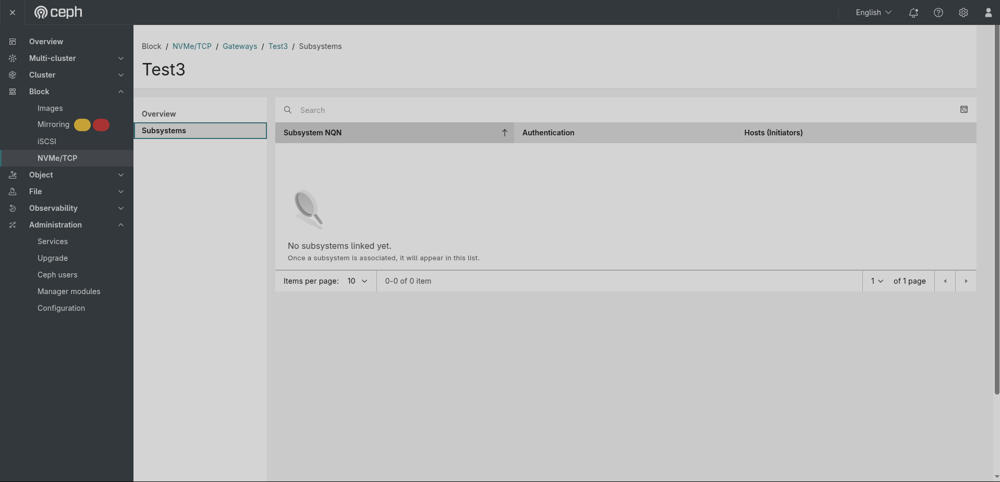
_Figure: The **Test3 → Subsystems** tab showing an empty state — "No subsystems linked yet. Once a subsystem is associated, it will appear in this list." Columns: Subsystem NQN, Authentication, Hosts (Initiators)._

The **Subsystems** tab shows all NVMe subsystems associated with this gateway group. The table columns are:

| Column                 | Description                                          |
| ---------------------- | ---------------------------------------------------- |
| **Subsystem NQN**      | The NVMe Qualified Name of the subsystem.            |
| **Authentication**     | The authentication mode configured on the subsystem. |
| **Hosts (Initiators)** | The number of initiator hosts permitted to connect.  |

When no subsystems have been created yet, the tab shows an empty state: _"No subsystems linked yet. Once a subsystem is associated, it will appear in this list."_ Subsystems are created from the top-level **Subsystems** tab (see Section 2).

---

### 1.4 Editing a Gateway Group

To modify an existing gateway group, click the **⋮** action menu on the gateway group row in the list and select **Edit**. This opens the **Edit Gateway Group** page — _"Modify gateway group configuration."_

#### Edit Step 1 — Change Nodes and Encryption

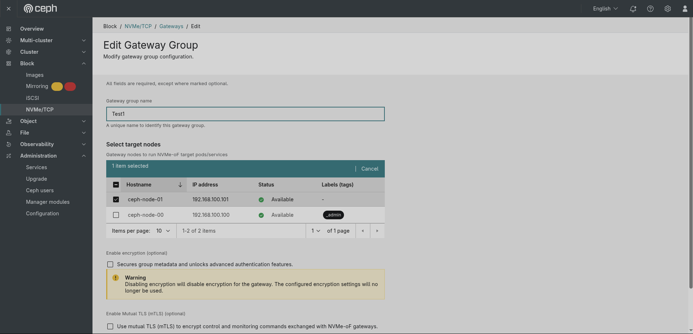
_Figure: The Edit Gateway Group form for **Test1** — Gateway group name field (pre-filled, editable), Select target nodes table with `ceph-node-01` selected, and the Enable encryption section showing a Warning that disabling encryption will remove all configured encryption settings._

The Edit form is identical in structure to the Create form, with the current values pre-populated:

- **Gateway group name** — the name field is pre-filled (e.g., `Test1`) and can be changed.
- **Select target nodes** — the currently assigned nodes are pre-selected (blue checkbox). You can add or remove nodes. The table shows all available nodes with their hostname, IP, status, and labels.
- **Enable encryption (optional)** — if encryption was previously enabled, unchecking it triggers a **Warning** banner:
  > _"Disabling encryption will disable encryption for the gateway. The configured encryption settings will no longer be used."_
- **Enable Mutual TLS (mTLS) (optional)** — pre-populated with the existing mTLS state.

#### Edit Step 2 — mTLS and Save

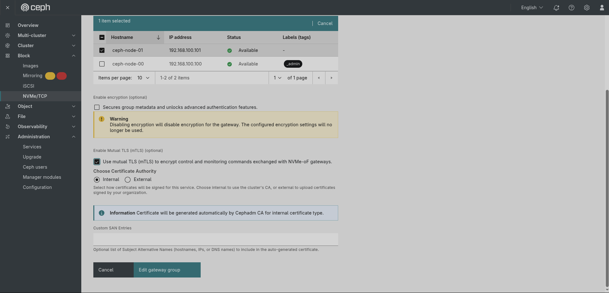
_Figure: Edit Gateway Group continued — mTLS checkbox enabled with **Internal** CA selected, the "Certificate will be generated automatically by Cephadm CA" info banner, Custom SAN Entries field, and the **Edit gateway group** button._

The mTLS section behaves identically to the Create flow. When **Internal** CA is selected, the Cephadm CA auto-generates the certificate. Custom SAN entries are optional.

Click **Edit gateway group** to save the changes, or **Cancel** to discard them.

### 1.5 Deleting a Gateway Group

To delete a gateway group, click the **⋮** action menu on the gateway group row and select **Delete**. A **Delete gateway group** confirmation dialog appears.

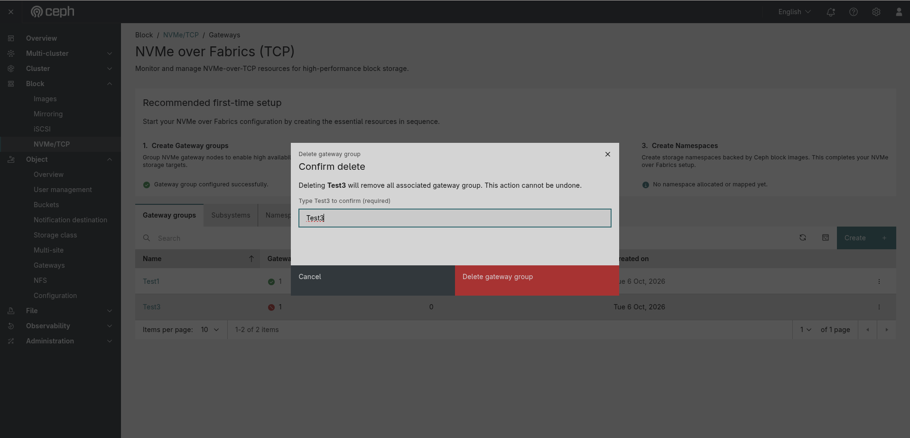
_Figure: The **Delete gateway group** dialog for **Test3** — warning that deleting will remove all associated gateway group data and cannot be undone, a text-confirmation field pre-filled with `Test3` (required to type), and the red **Delete gateway group** button that activates only when the name matches._

The dialog body reads: _"Deleting **Test3** will remove all associated gateway group. This action cannot be undone."_ You must type the exact gateway group name (e.g., `Test3`) into the **Name of resource** field. The red **Delete gateway group** button activates only when the typed name matches. Click **Cancel** to abort.

> **Note:** Before deleting a gateway group, ensure no subsystems or namespaces are attached to it. Deleting a group that still has associated resources may leave those resources in an inconsistent state.

---

## 2. Subsystems

Once the gateway group is configured, the next step is to create **NVMe subsystems** — logical targets that group namespaces and control which hosts can connect.

### 2.1 The Subsystems Tab

Navigate to the **Subsystems** tab on the NVMe/TCP landing page.

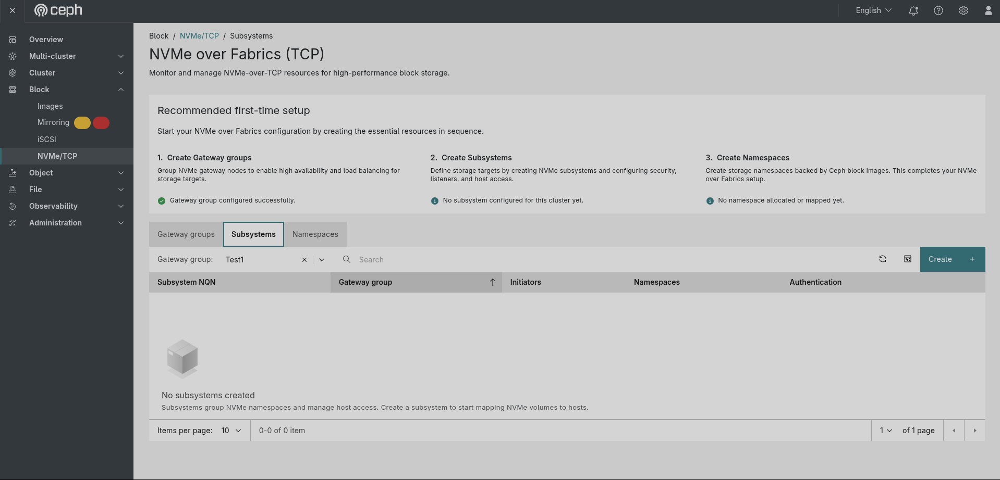
_Figure: The **Block → NVMe/TCP → Subsystems** tab with **Gateway group: Test1** filter applied — empty state: "No subsystems created. Subsystems group NVMe namespaces and manage host access." Columns: Subsystem NQN, Gateway group, Initiators, Namespaces, Authentication._

The tab provides a **Gateway group** dropdown filter to scope the view to one group. The table columns are:

| Column             | Description                                                                                  |
| ------------------ | -------------------------------------------------------------------------------------------- |
| **Subsystem NQN**  | The globally unique NVMe Qualified Name for the subsystem. Click to open the detail view.    |
| **Gateway group**  | The gateway group routing traffic for this subsystem.                                        |
| **Initiators**     | The number of host initiators allowed to connect.                                            |
| **Namespaces**     | The number of block namespaces exposed through this subsystem.                               |
| **Authentication** | The authentication mode — a ⚠ orange warning icon appears when set to **No authentication**. |

### 2.2 Creating a Subsystem

Click **Create** on the Subsystems tab. This opens the **Create Subsystem** wizard — _"Subsystems define how hosts connect to NVMe namespaces and ensure secure access to storage."_ The wizard has four steps shown in the left sidebar: **Subsystem details**, **Host access control**, **Authentication**, and **Review**.

#### Step 1 — Subsystem Details

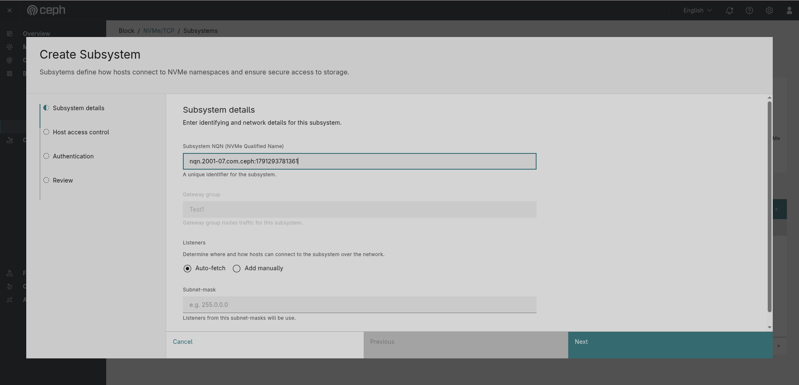
_Figure: Create Subsystem wizard — **Subsystem details** step. Fields: Subsystem NQN (pre-filled `nqn.2001-07.com.ceph:1791293781361`), Gateway group (read-only, `Test1`), Listeners (Auto-fetch / Add manually radio), Subnet-mask. Navigation: Cancel / Previous / Next._

Fill in the following fields:

- **Subsystem NQN (NVMe Qualified Name)** — a unique identifier for the subsystem (e.g., `nqn.2001-07.com.ceph:1791293781361`). The hint reads _"A unique identifier for the subsystem."_ An NQN is auto-generated but can be edited. Append a descriptive suffix (e.g., `.Test1`) for clarity.
- **Gateway group** — read-only, automatically set to the currently selected gateway group (e.g., `Test1`). The hint reads _"Gateway group routes traffic for this subsystem."_
- **Listeners** — determines where and how hosts can connect to the subsystem over the network:
  - **Auto-fetch** _(default)_ — listeners are automatically derived from the gateway group nodes.
  - **Add manually** — specify listener addresses manually.
- **Subnet-mask** _(optional)_ — when Auto-fetch is selected, you can optionally restrict which gateway node addresses are used by providing a subnet mask (e.g., `255.0.0.0`). The hint reads _"Listeners from this subnet-masks will be use."_

Click **Next** to proceed.

#### Step 2 — Host Access Control

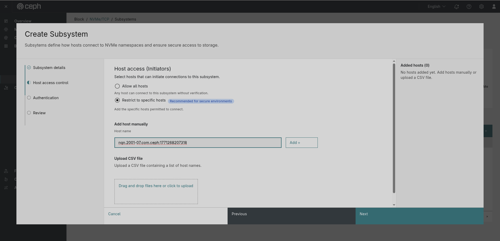
_Figure: Create Subsystem wizard — **Host access control** step. Options: Allow all hosts / Restrict to specific hosts (Recommended for secure environments badge). Add host manually field with NQN input and Add + button. Upload CSV file drop zone. Right panel: Added hosts (0) — "No hosts added yet."_

Configure which initiators can connect:

- **Allow all hosts** — any host can connect to this subsystem without verification.
- **Restrict to specific hosts** _(recommended, shown with a **Recommended for secure environments** badge)_ — only the hosts you explicitly add are permitted. The hint reads _"Add the specific hosts permitted to connect."_

When **Restrict to specific hosts** is selected, two input methods appear:

- **Add host manually** — enter the host NQN (e.g., `nqn.2001-07.com.ceph:1771268207318`) in the **Host name** field and click **Add +**. Added hosts appear in the **Added hosts** panel on the right.
- **Upload CSV file** — drag and drop a CSV file containing a list of host NQNs, or click the upload zone to browse. The hint reads _"Upload a CSV file containing a list of host names."_

Click **Next** to proceed.

#### Step 3 — Authentication

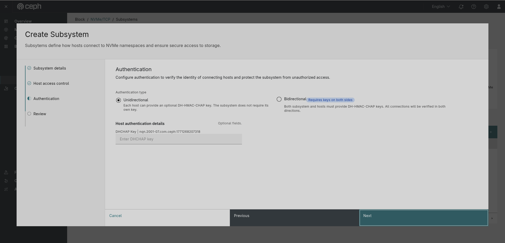
_Figure: Create Subsystem wizard — **Authentication** step. Authentication type: Unidirectional (selected) / Bidirectional (Requires keys on both sides badge). Host authentication details section with DHCHAP Key field for the added host NQN. Navigation: Cancel / Previous / Next._

Configure authentication between the subsystem and connecting hosts:

- **Unidirectional** _(default)_ — each host can optionally provide a DH-HMAC-CHAP key. The subsystem does not require its own key. Description: _"Each host can provide an optional DH-HMAC-CHAP key. The subsystem does not require its own key."_
- **Bidirectional** _(shown with a **Requires keys on both sides** badge)_ — both the subsystem and all hosts must provide DH-HMAC-CHAP keys. Description: _"Both subsystem and hosts must provide DH-HMAC-CHAP keys. All connections will be verified in both directions."_

The **Host authentication details** section shows one entry per added host. The field is labelled `DHCHAP Key | <host-NQN>` with placeholder text _"Enter DHCHAP key"_. These are **Optional fields** — leave blank to skip host-level key authentication.

Click **Next** to proceed.

#### Step 4 — Review

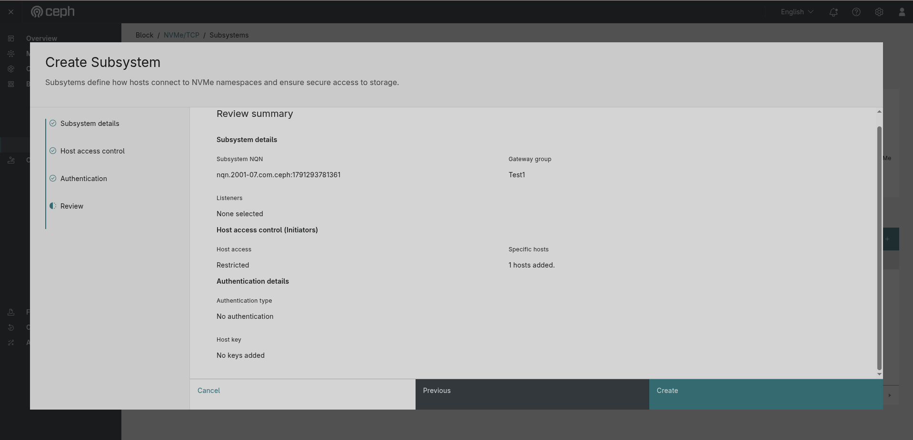
_Figure: Create Subsystem wizard — **Review** step. Shows a full summary: Subsystem NQN, Gateway group (Test1), Listeners (None selected), Host access control (Restricted / 1 hosts added), Authentication details (No authentication / No keys added). Navigation: Cancel / Previous / **Create**._

The **Review summary** page displays a read-only summary of all configuration choices before committing:

| Section                              | Fields shown                                             |
| ------------------------------------ | -------------------------------------------------------- |
| **Subsystem details**                | Subsystem NQN, Gateway group, Listeners                  |
| **Host access control (Initiators)** | Host access (Restricted / Allowed), Specific hosts count |
| **Authentication details**           | Authentication type, Host key status                     |

Review all values. Click **Previous** to go back and edit any step, or click **Create** to create the subsystem.

### 2.3 The Subsystem List After Creation

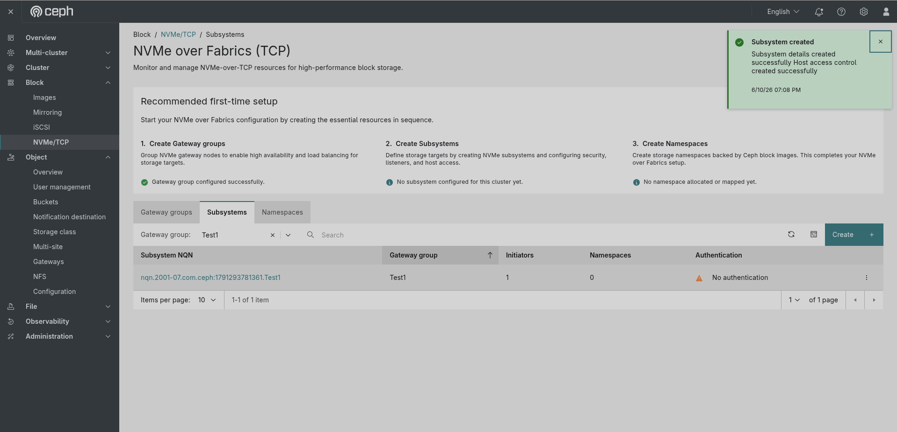
_Figure: The **Subsystems** tab after a subsystem is created — success toast "Subsystem created. Subsystem details created successfully. Host access control created successfully." The list shows `nqn.2001-07.com.ceph:1791293781361.Test1` in gateway group **Test1**, 1 Initiator, 0 Namespaces, ⚠ No authentication._

After clicking **Create**, a green success notification appears in the top-right corner:

> _"Subsystem created — Subsystem details created successfully. Host access control created successfully."_ (6/10/26 07:08 PM)

The new subsystem appears in the table. Note the ⚠ orange warning icon next to **No authentication** — this is a reminder that enabling authentication is recommended for production environments.

### 2.4 Subsystem Detail View

Clicking the subsystem NQN (e.g., `nqn.2001-07.com.ceph:1791293781361.Test1`) opens its detail view. The left sidebar shows five tabs: **Overview**, **Initiators**, **Namespaces**, **Listeners**, and **Performance**.

#### Overview Tab

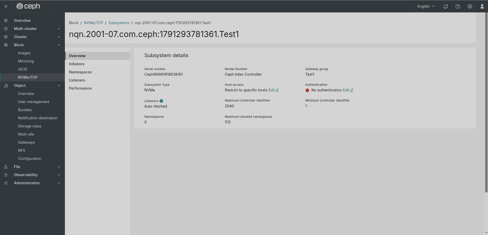
_Figure: Subsystem detail view — **Overview** tab showing Subsystem details: Serial number (Ceph96660918038161), Model Number (Ceph bdev Controller), Gateway group (Test1), Subsystem Type (NVMe), Host access (Restrict to specific hosts — Edit link), Authentication (🔴 No authentication — Edit link), Listeners (Auto-fetched ℹ), Maximum Controller Identifier (2040), Minimum Controller Identifier (1), Namespaces (0), Maximum allowed namespaces (512)._

The **Subsystem details** panel contains:

| Property                          | Value / Description                                                                         |
| --------------------------------- | ------------------------------------------------------------------------------------------- |
| **Serial number**                 | Auto-generated serial (e.g., `Ceph96660918038161`).                                         |
| **Model Number**                  | Always `Ceph bdev Controller`.                                                              |
| **Gateway group**                 | The gateway group this subsystem belongs to (e.g., `Test1`).                                |
| **Subsystem Type**                | Always `NVMe`.                                                                              |
| **Host access**                   | Current host access mode (e.g., `Restrict to specific hosts`) with an inline **Edit** link. |
| **Authentication**                | Current auth mode — 🔴 **No authentication** with an inline **Edit** link.                  |
| **Listeners**                     | How listeners are configured — `Auto-fetched` with an info icon ℹ.                          |
| **Maximum Controller Identifier** | `2040`                                                                                      |
| **Minimum Controller Identifier** | `1`                                                                                         |
| **Namespaces**                    | Current namespace count (e.g., `0`).                                                        |
| **Maximum allowed namespaces**    | `512`                                                                                       |

#### Initiators Tab

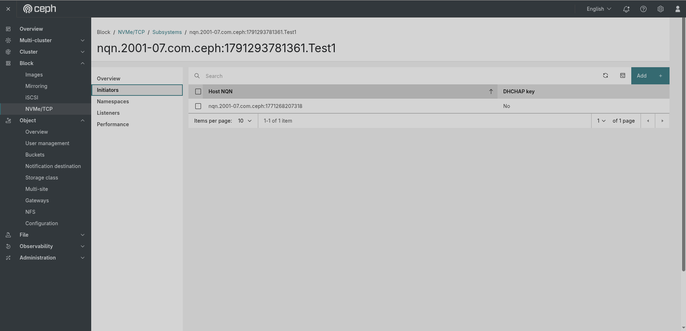
_Figure: Subsystem **Initiators** tab — table with columns Host NQN and DHCHAP key. One row: `nqn.2001-07.com.ceph:1771268207318`, DHCHAP key: No. Action bar at top: 1 item selected — **Edit host key** | **Remove** | Cancel buttons._

The **Initiators** tab lists all host NQNs permitted to connect to this subsystem. The table columns are:

| Column         | Description                                                                   |
| -------------- | ----------------------------------------------------------------------------- |
| **Host NQN**   | The NVMe Qualified Name of the initiator host.                                |
| **DHCHAP key** | Whether a DH-HMAC-CHAP key is configured for this host — `No` if none is set. |

When one or more rows are selected (checkbox), a teal action bar appears at the top with three actions: **Edit host key**, **Remove**, and **Cancel**.

**Adding an initiator after subsystem creation** is done via a dedicated **Add Initiator** wizard accessible from the Initiators tab. The wizard has two steps: **Host access control** and **Authentication (optional)**.

##### Add Initiator — Step 1: Host Access Control

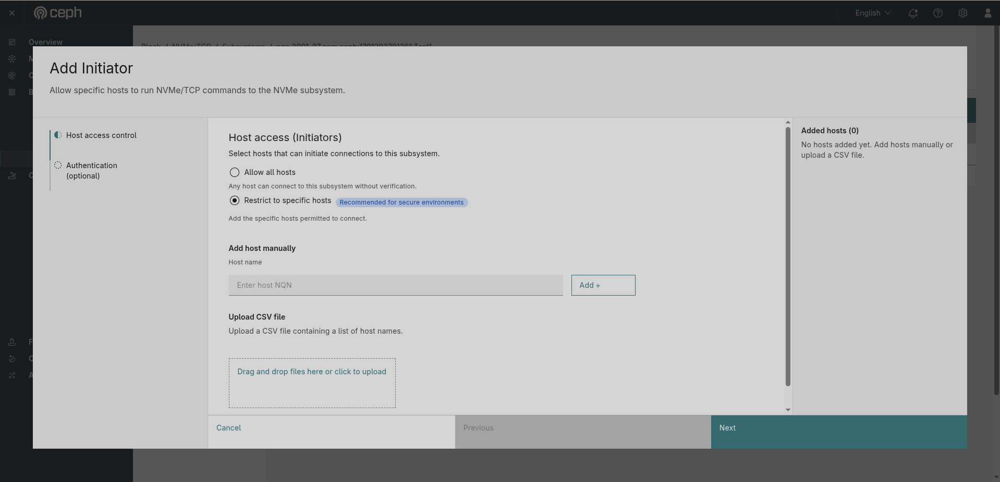
_Figure: **Add Initiator** wizard — **Host access control** step. Options: Allow all hosts / Restrict to specific hosts (Recommended badge, selected). Add host manually field (Enter host NQN + Add + button). Upload CSV file drop zone. Right panel: Added hosts (0)._

The Add Initiator form is identical to the subsystem creation Host access control step:

- **Allow all hosts** — grants access to every initiator on the network. Note: authentication is not supported in this mode.
- **Restrict to specific hosts** _(recommended)_ — add NQNs manually via the **Host name** field + **Add +** button, or upload a CSV file.

Click **Next** to proceed to the optional Authentication step.

##### Add Initiator — Step 2: Authentication (Optional)

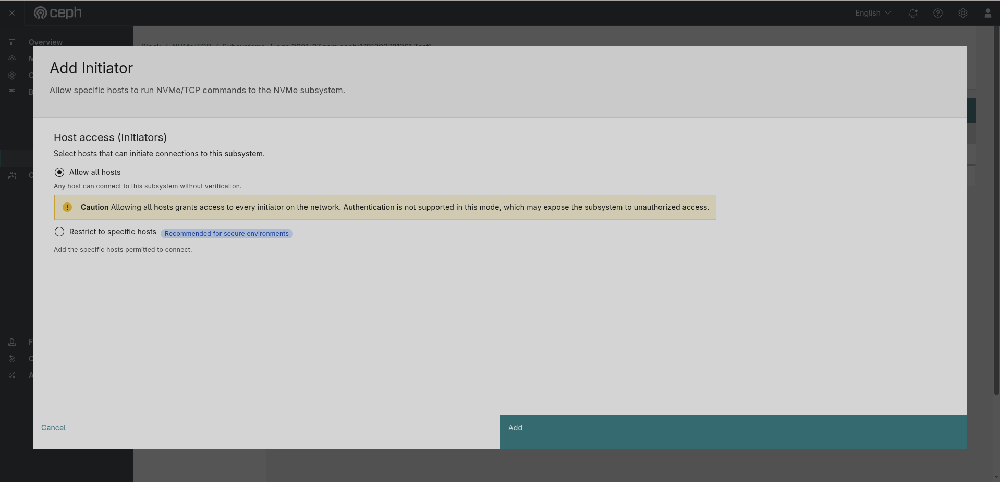
_Figure: **Add Initiator** wizard — **Authentication (optional)** step. Authentication type: Unidirectional (selected) / Bidirectional. Host authentication details showing DHCHAP Key field for the host NQN. Navigation: Cancel / Previous / Next._

Configure the DH-HMAC-CHAP key for the new host (same as the Authentication step in the Create Subsystem wizard). Click **Next** to complete adding the initiator.

**Editing a host key** — select a host row and click **Edit host key** in the action bar. This opens the **Edit Host Key** dialog.

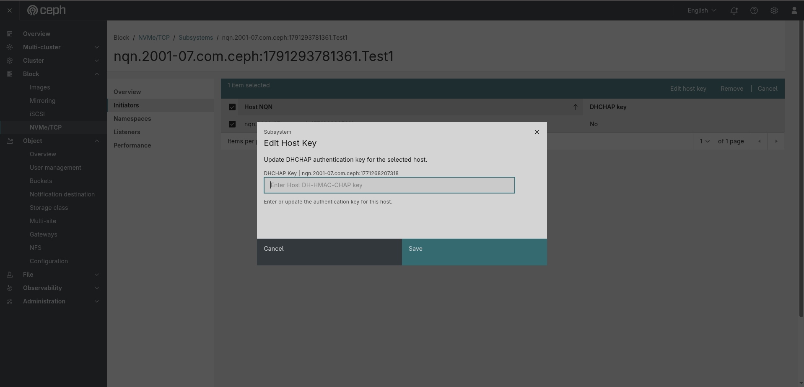
_Figure: The **Edit Host Key** dialog for subsystem `nqn.2001-07.com.ceph:1791293781361.Test1` — subtitle "Update DHCHAP authentication key for the selected host." Field: DHCHAP Key | `nqn.2001-07.com.ceph:1771268207318` with placeholder "Enter Host DH-HMAC-CHAP key" and hint "Enter or update the authentication key for this host." Buttons: Cancel / Save._

The dialog is titled _"Edit Host Key"_ with subtitle _"Update DHCHAP authentication key for the selected host."_ Enter the new DH-HMAC-CHAP key in the text field and click **Save**, or **Cancel** to discard.

**Removing a specific host** — select the host row and click **Remove** in the action bar. A **Remove host — Confirm remove** dialog appears.

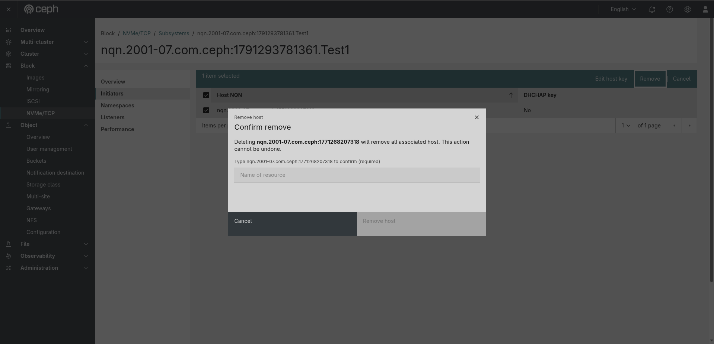
_Figure: The **Remove host — Confirm remove** dialog — warning "Deleting **nqn.2001-07.com.ceph:1771268207318** will remove all associated host. This action cannot be undone." Text-confirmation field "Type nqn.2001-07.com.ceph:1771268207318 to confirm (required)". Buttons: Cancel / Remove host (greyed until confirmed)._

The dialog warns: _"Deleting **nqn.2001-07.com.ceph:1771268207318** will remove all associated host. This action cannot be undone."_ Type the full NQN into the confirmation field to activate the **Remove host** button.

**Removing the "Allow any host" entry** — when the subsystem is in **Allow all hosts** mode, the Initiators tab shows an `Allow any host(*)` row. A warning banner reads:

> ⚠ **All hosts allowed** — _"Allowing all hosts grants access to every initiator on the network. Authentication is not supported in this mode, which may expose the subsystem to unauthorized access."_

Selecting that row and clicking **Remove** opens the **Remove host — Confirm remove** dialog for `Allow any host(*)`.

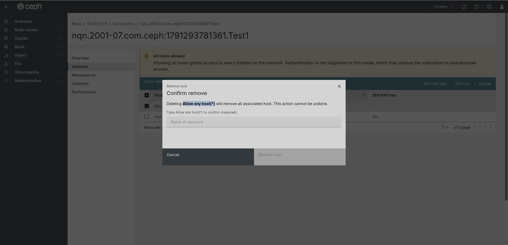
_Figure: The Initiators tab with the **All hosts allowed** warning banner visible, and the Remove host Confirm remove dialog open for **Allow any host(\*)** — text-confirmation field requires typing `Allow any host(*)` to activate the Remove host button._

#### Listeners Tab

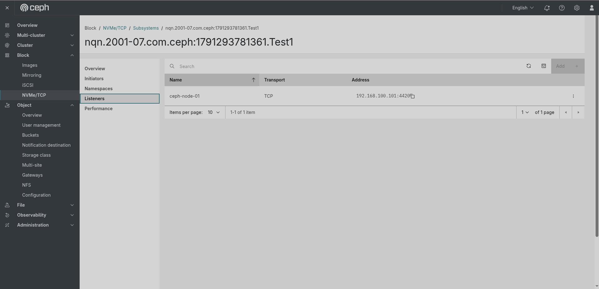
_Figure: Subsystem **Listeners** tab — table with columns Name, Transport, Address. One row: `ceph-node-01`, TCP, `192.168.100.101:4420`. Top-right: **Add** button._

The **Listeners** tab shows the network endpoints where this subsystem accepts NVMe/TCP connections. The table columns are:

| Column        | Description                                                                                                             |
| ------------- | ----------------------------------------------------------------------------------------------------------------------- |
| **Name**      | The gateway node hostname serving as the listener (e.g., `ceph-node-01`).                                               |
| **Transport** | The transport protocol — always `TCP` for NVMe/TCP.                                                                     |
| **Address**   | The IP address and port the listener binds to (e.g., `192.168.100.101:4420`). The copy icon allows copying the address. |

The **Add** button in the top-right corner opens a form to manually add a listener when **Add manually** was selected during subsystem creation.

#### Namespaces Tab (within Subsystem)

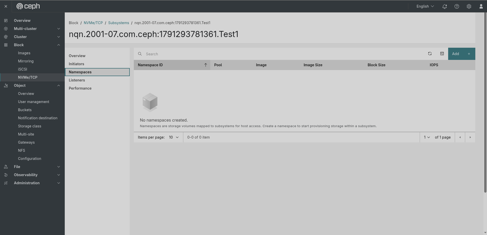
_Figure: Subsystem **Namespaces** tab — empty state: "No namespaces created. Namespaces are storage volumes mapped to subsystems for host access." Columns: Namespace ID, Pool, Image, Image Size, Block Size, IOPS. Top-right: **Add** button._

The **Namespaces** tab within the subsystem detail view shows all namespaces attached to this specific subsystem. The table columns are:

| Column           | Description                                             |
| ---------------- | ------------------------------------------------------- |
| **Namespace ID** | The numeric NSID within this subsystem.                 |
| **Pool**         | The RADOS pool containing the backing RBD image.        |
| **Image**        | The RBD image name.                                     |
| **Image Size**   | The size of the backing image.                          |
| **Block Size**   | The logical block size exposed to the host.             |
| **IOPS**         | Real-time I/O operations per second for this namespace. |

Click **Add** to create a namespace directly from within the subsystem context.

### 2.5 Deleting a Subsystem

To delete a subsystem, go to **Block → NVMe/TCP → Subsystems**, select the subsystem row, and choose **Delete** from the action menu (or the table actions bar). A **Confirm delete** dialog opens.

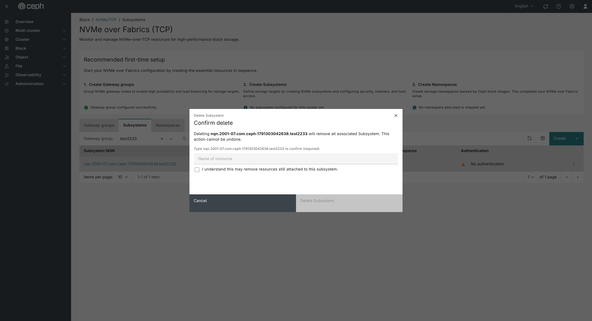
_Figure: **Confirm delete** dialog for `nqn.2001-07.com.ceph:1791303042638.test2233` — warning that the action cannot be undone, empty **Name of resource** field, unchecked acknowledgement checkbox, and a greyed-out **Delete Subsystem** button._

The dialog warns: _"Deleting **nqn.2001-07.com.ceph:1791303042638.test2233** will remove all associated Subsystem. This action cannot be undone."_

Before the destructive button activates you must:

1. Type the exact subsystem NQN into the **Name of resource** field.
2. Check **I understand this may remove resources still attached to this subsystem.**

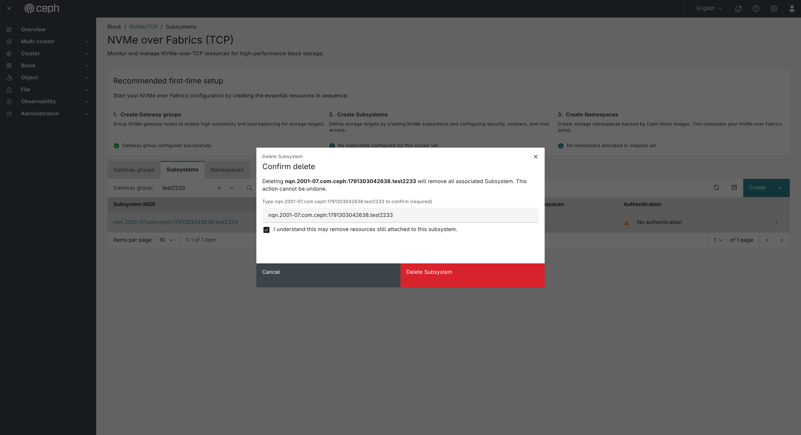
_Figure: Same dialog after the full NQN is typed and the acknowledgement checkbox is checked — the red **Delete Subsystem** button is enabled._

Click **Delete Subsystem** to remove it, or **Cancel** to abort.

**Note:** Prefer deleting namespaces (and clearing host access) first when possible. The acknowledgement checkbox exists because deleting a subsystem can also remove resources that are still attached to it.

---

## 3. Namespaces

After creating subsystems, the final step is to create **Namespaces** — storage volumes backed by Ceph RBD images that are mapped to a subsystem and made accessible to initiator hosts over NVMe/TCP.

### 3.1 The Namespaces Tab — Empty State

Navigate to the **Namespaces** tab on the NVMe/TCP landing page.

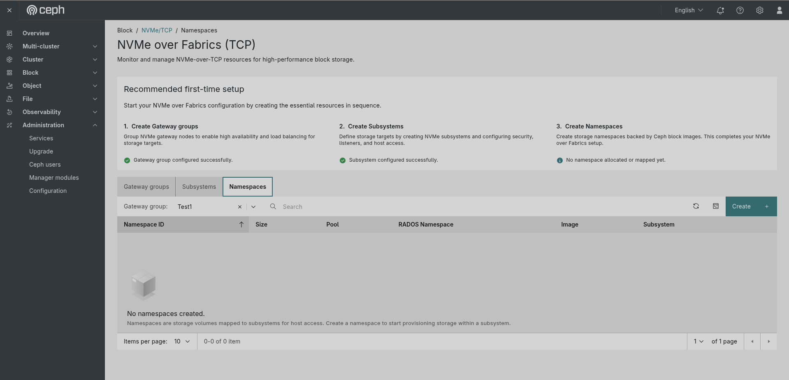
_Figure: The **Block → NVMe/TCP → Namespaces** tab with Gateway group: **Test1** — all three setup steps complete (Gateway group ✅, Subsystem ✅, Namespaces ℹ "No namespace allocated or mapped yet"). Empty state: "No namespaces created." Columns: Namespace ID, Size, Pool, RADOS Namespace, Image, Subsystem._

At this point the banner shows that steps 1 and 2 are complete (✅) while step 3 is still pending (ℹ). The empty-state message reads: _"No namespaces created. Namespaces are storage volumes mapped to subsystems for host access. Create a namespace to start provisioning storage within a subsystem."_

### 3.2 Creating a Namespace

Click **Create** on the Namespaces tab. This opens the **Create Namespace** page — breadcrumb: `Block / NVMe/TCP / Namespaces / Create`. The subtitle reads _"Namespaces define the storage volumes that subsystems present to hosts."_

#### Step 1 — Namespace Configuration

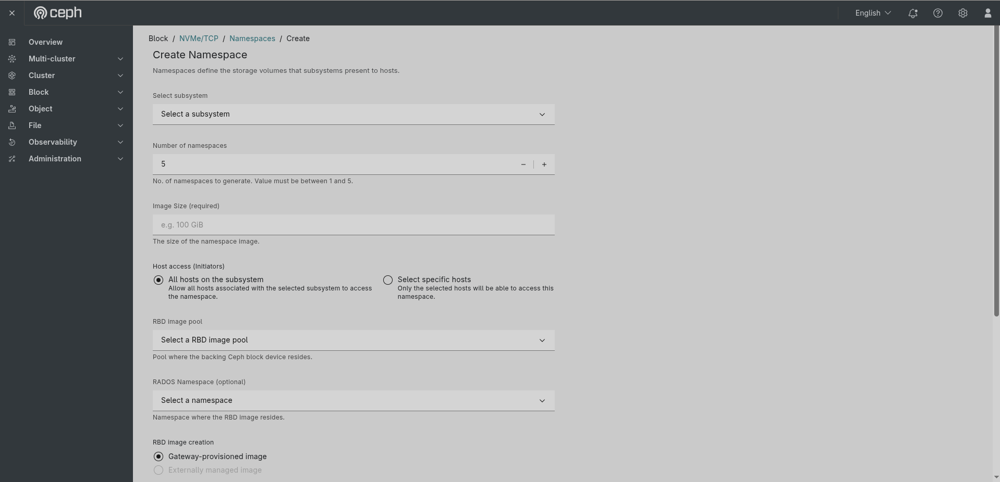
_Figure: The **Create Namespace** form — fields: Select subsystem (dropdown), Number of namespaces (spinner, default 5, hint: "No. of namespaces to generate. Value must be between 1 and 5."), Image Size (required, e.g. 100 GiB), Host access (All hosts on the subsystem / Select specific hosts), RBD image pool (dropdown), RADOS Namespace (optional dropdown), RBD image creation (Gateway-provisioned image / Externally managed image radio)._

Fill in the following fields:

- **Select subsystem** — choose the subsystem NQN this namespace will be attached to (dropdown).
- **Number of namespaces** — how many namespaces to create in one operation. The hint reads _"No. of namespaces to generate. Value must be between 1 and 5."_ Default is `5`; use the − / + spinner to adjust.
- **Image Size (required)** — the size of each backing RBD image (e.g., `100 GiB`). The hint reads _"The size of the namespace image."_
- **Host access (Initiators)** — choose who can access this namespace:
  - **All hosts on the subsystem** _(default)_ — _"Allow all hosts associated with the selected subsystem to access the namespace."_
  - **Select specific hosts** — _"Only the selected hosts will be able to access this namespace."_
- **RBD image pool** — the RADOS pool where the backing RBD image resides. The hint reads _"Pool where the backing Ceph block device resides."_
- **RADOS Namespace (optional)** — the RADOS namespace within the pool. The hint reads _"Namespace where the RBD image resides."_
- **RBD image creation** — choose how the backing image is managed:
  - **Gateway-provisioned image** _(default)_ — the gateway creates and manages the RBD image automatically.
  - **Externally managed image** _(greyed out when bulk creation is selected)_ — use a pre-existing RBD image.

#### Step 2 — Image Name, Block Size and Create

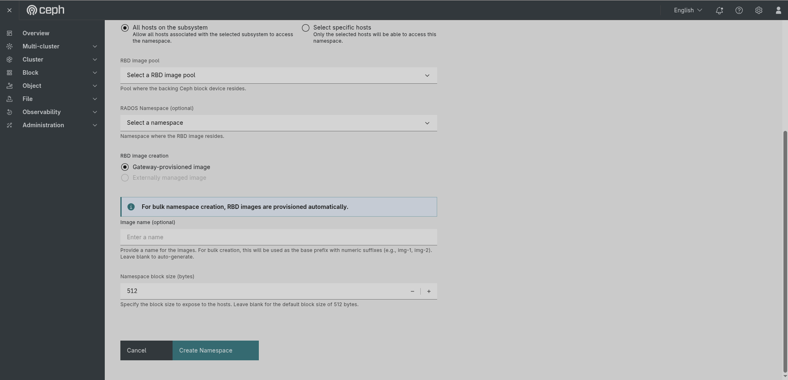
_Figure: Create Namespace form scrolled down — Host access radio (All hosts on subsystem selected), RBD image pool dropdown, RADOS Namespace dropdown, RBD image creation (Gateway-provisioned selected), blue info banner "For bulk namespace creation, RBD images are provisioned automatically.", Image name (optional, hint: base prefix with numeric suffixes), Namespace block size (bytes) spinner (default 512, hint: "Specify the block size to expose to the hosts. Leave blank for the default block size of 512 bytes."), Cancel / **Create Namespace** buttons._

The form continues with:

- **RBD image creation** info banner — when **Gateway-provisioned image** is selected and more than one namespace is requested, a blue info banner reads: _"For bulk namespace creation, RBD images are provisioned automatically."_
- **Image name (optional)** — a base name for the RBD images. The hint reads _"Provide a name for the images. For bulk creation, this will be used as the base prefix with numeric suffixes (e.g., img-1, img-2). Leave blank to auto-generate."_
- **Namespace block size (bytes)** — the logical block size exposed to hosts, default `512`. The hint reads _"Specify the block size to expose to the hosts. Leave blank for the default block size of 512 bytes."_ Use the − / + spinner to adjust.

Click **Create Namespace** to create the namespace(s), or **Cancel** to discard.

### 3.3 The Namespaces Tab — After Creation

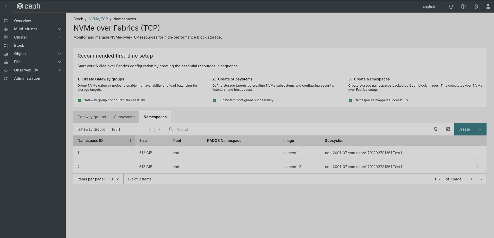
_Figure: The **Block → NVMe/TCP → Namespaces** tab after creation — all three setup steps show ✅ (Gateway group configured, Subsystem configured, Namespaces mapped successfully). Two namespaces listed: ID 1 (512 GiB, pool `rbd`, image `nvmeof.-1`, subsystem `nqn.2001-07.com.ceph:1791293781361.Test1`) and ID 2 (512 GiB, pool `rbd`, image `nvmeof.-2`, same subsystem). Each row has a ⋮ action menu._

Once namespaces are created, all three setup-sequence steps show ✅. The table columns are:

| Column              | Description                                                           |
| ------------------- | --------------------------------------------------------------------- |
| **Namespace ID**    | The numeric NSID within the subsystem (e.g., `1`, `2`).               |
| **Size**            | The size of the backing RBD image (e.g., `512 GiB`).                  |
| **Pool**            | The RADOS pool containing the RBD image (e.g., `rbd`).                |
| **RADOS Namespace** | The RADOS namespace within the pool (blank if the default namespace). |
| **Image**           | The RBD image name (e.g., `nvmeof.-1`, `nvmeof.-2`).                  |
| **Subsystem**       | The subsystem NQN this namespace is attached to.                      |

The **⋮** action menu on each row provides **Expand** and **Delete** options.

### 3.4 Expanding a Namespace

To increase a namespace's storage capacity, click the **⋮** action menu on the namespace row and select **Expand**. This opens the **Expand namespace** dialog.

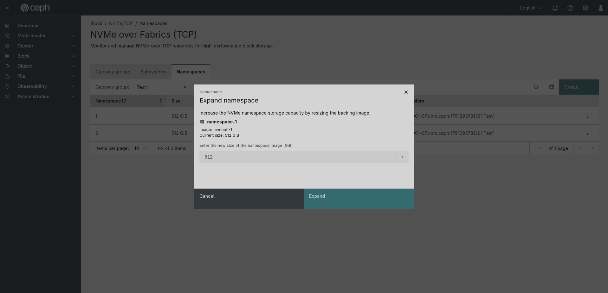
_Figure: The **Expand namespace** dialog for `namespace-1` — subtitle "Increase the NVMe namespace storage capacity by resizing the backing image." Shows Image: `nvmeof.-1`, Current size: 512 GiB. Field: "Enter the new size of the namespace image (GiB)" spinner pre-filled with `512`. Buttons: Cancel / **Expand**._

The dialog shows:

- **Namespace name** — the namespace identifier (e.g., `namespace-1`).
- **Image** — the backing RBD image (e.g., `nvmeof.-1`).
- **Current size** — the existing capacity (e.g., `512 GiB`).
- **New size field** — enter the new size in GiB using the − / + spinner. The new value must be greater than the current size (namespaces can only be expanded, not shrunk).

Click **Expand** to resize, or **Cancel** to discard.

### 3.5 Deleting a Namespace

To delete a namespace, click the **⋮** action menu and select **Delete**. A **Delete Namespace — Confirm delete** dialog appears.

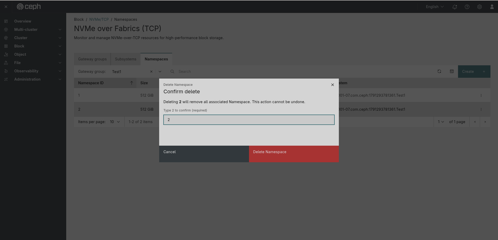
_Figure: The **Delete Namespace — Confirm delete** dialog for namespace ID **2** — warning "Deleting 2 will remove all associated Namespace. This action cannot be undone." Text-confirmation field pre-filled with `2` (required). Red **Delete Namespace** button active once the ID is typed. Buttons: Cancel / **Delete Namespace**._

The dialog reads: _"Deleting **2** will remove all associated Namespace. This action cannot be undone."_ Type the namespace ID into the confirmation field to activate the red **Delete Namespace** button.

---

## Key Features of the Dashboard for NVMe/TCP Management

### 1. Guided Three-Step Setup Sequence

The **Recommended first-time setup** banner tracks all three steps (Gateway groups → Subsystems → Namespaces) with live ✅ / ℹ status indicators, so operators always know exactly where they are in the configuration flow.

### 2. Flexible Certificate Management

When enabling mTLS, the Dashboard offers **Internal** (Cephadm CA auto-generates certificates with optional Custom SAN Entries) and **External** (upload Root CA, client cert/key, server cert/key) modes — covering both development and enterprise PKI environments.

### 3. Four-Step Subsystem Creation Wizard

The Create Subsystem wizard guides through Subsystem details → Host access control → Authentication → Review, with the full configuration visible in a Review summary before committing. This prevents misconfiguration and makes all choices auditable before creation.

### 4. Flexible Host Access and Authentication

The Dashboard supports both **Allow all hosts** and **Restrict to specific hosts** modes, with **Unidirectional** or **Bidirectional** DH-HMAC-CHAP authentication. Hosts can be added manually by NQN or bulk-imported via CSV file.

### 5. In-Place Host Key Management

Per-host DHCHAP keys can be updated at any time via the **Edit host key** dialog on the Initiators tab, without recreating the subsystem or interrupting other connections.

### 6. Namespace Expand Without Downtime

The **Expand namespace** dialog allows resizing a namespace's backing RBD image in-place, increasing capacity without unmounting the device or interrupting the connected host.

### 7. Type-to-Confirm Destructive Operations

All delete and remove operations (gateway group, subsystem, host, namespace) require typing the resource name or ID into a confirmation field before the destructive button activates, preventing accidental data loss. Subsystem delete also requires an extra acknowledgement that attached resources may be removed.

### 8. Live Listener Discovery

The **Listeners** tab on each subsystem shows the exact TCP address and port (`IP:4420`) that initiators should target, with a copy button for easy use in `nvme connect` commands.

---

## Conclusion

Ceph NVMe/TCP brings enterprise-grade, low-latency block storage over standard IP networks — and the Ceph Dashboard makes the entire configuration lifecycle manageable without touching the command line.

In this walkthrough, we covered the complete end-to-end flow:

1. **Deploying the nvmeof service** — using the Dashboard's Create service dialog to run the SPDK-based NVMe-oF daemon on the target host.
2. **Creating a gateway group** — entering a group name, selecting target nodes, and optionally enabling encryption and mTLS (Internal CA or External with full PEM upload).
3. **Viewing and managing gateway groups** — reading the gateway list, exploring the detail view (Overview + Subsystems tabs), editing configuration, and deleting with the type-to-confirm guard.
4. **Creating a subsystem** — using the four-step wizard (Subsystem details → Host access control → Authentication → Review) to define the NVMe target, configure listeners, restrict host access by NQN, and set DH-HMAC-CHAP authentication.
5. **Managing initiators** — adding hosts individually or by CSV, editing per-host DHCHAP keys, removing specific hosts or clearing the allow-all entry.
6. **Viewing listeners** — confirming the auto-fetched TCP address and port that initiators use to connect.
7. **Creating namespaces** — using the Create Namespace form to map gateway-provisioned or externally managed RBD images to a subsystem, with bulk creation support.
8. **Managing namespaces** — expanding capacity in-place with the Expand dialog, and deleting with the type-to-confirm guard.
9. **Deleting a subsystem** — type-to-confirm the NQN plus an acknowledgement checkbox before the red **Delete Subsystem** button activates.

Whether you are powering virtual machine disks, Kubernetes persistent volumes, or bare-metal database hosts, Ceph NVMe/TCP delivers high-throughput, low-latency block storage over standard Ethernet — fully manageable through the Ceph Dashboard.

## Further Reading

- [IBM Storage Ceph 9.9.1 — NVMe Gateway](https://www.ibm.com/docs/en/storage-ceph/9.9.1?topic=ceph-nvme-gateway) — the official IBM Storage Ceph overview of the NVMe gateway, covering architecture, deployment, and configuration of the NVMe-oF target in IBM Storage Ceph.
- [IBM Storage Ceph 9.9.1 — Defining an NVMe subsystem](https://www.ibm.com/docs/en/storage-ceph/9.9.1?topic=target-managing-subsystems) — the official IBM Storage Ceph reference for creating and configuring NVMe subsystems, covering NQN format, listener configuration, host access control, and DH-HMAC-CHAP authentication.
- [Ceph NVMe-oF Target Configuration](https://docs.ceph.com/en/latest/rbd/nvmeof-target-configure/) — the official Ceph documentation for configuring the NVMe-oF target, covering gateway deployment with cephadm, subsystem and namespace management, host access control, and CLI reference.
