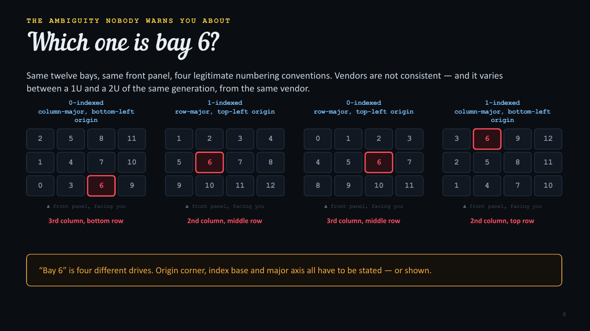
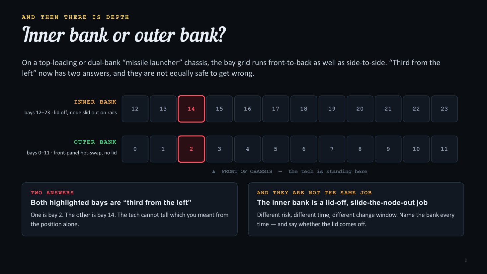
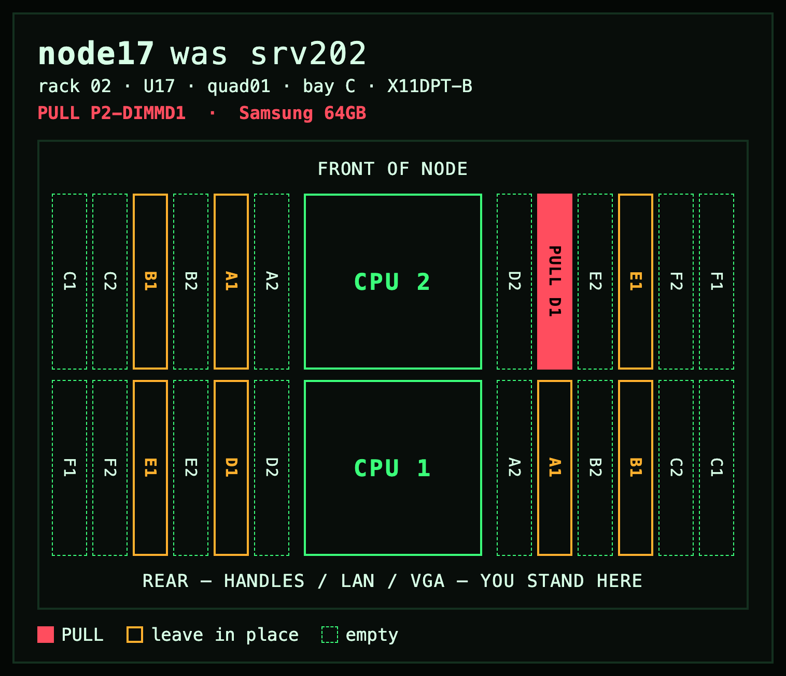
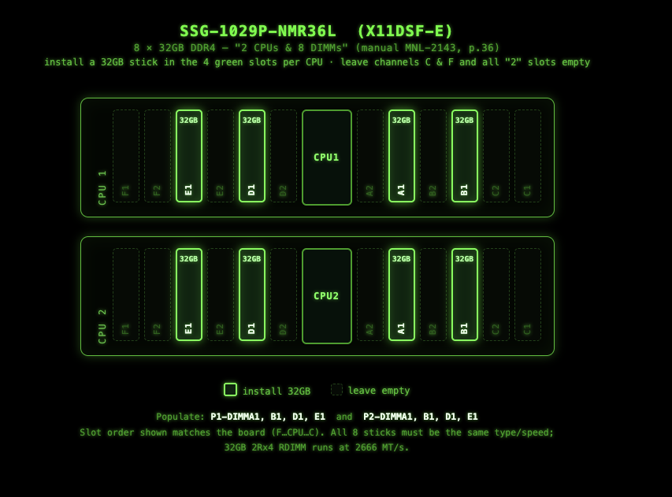
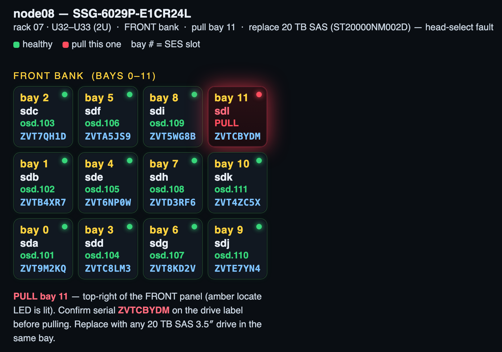
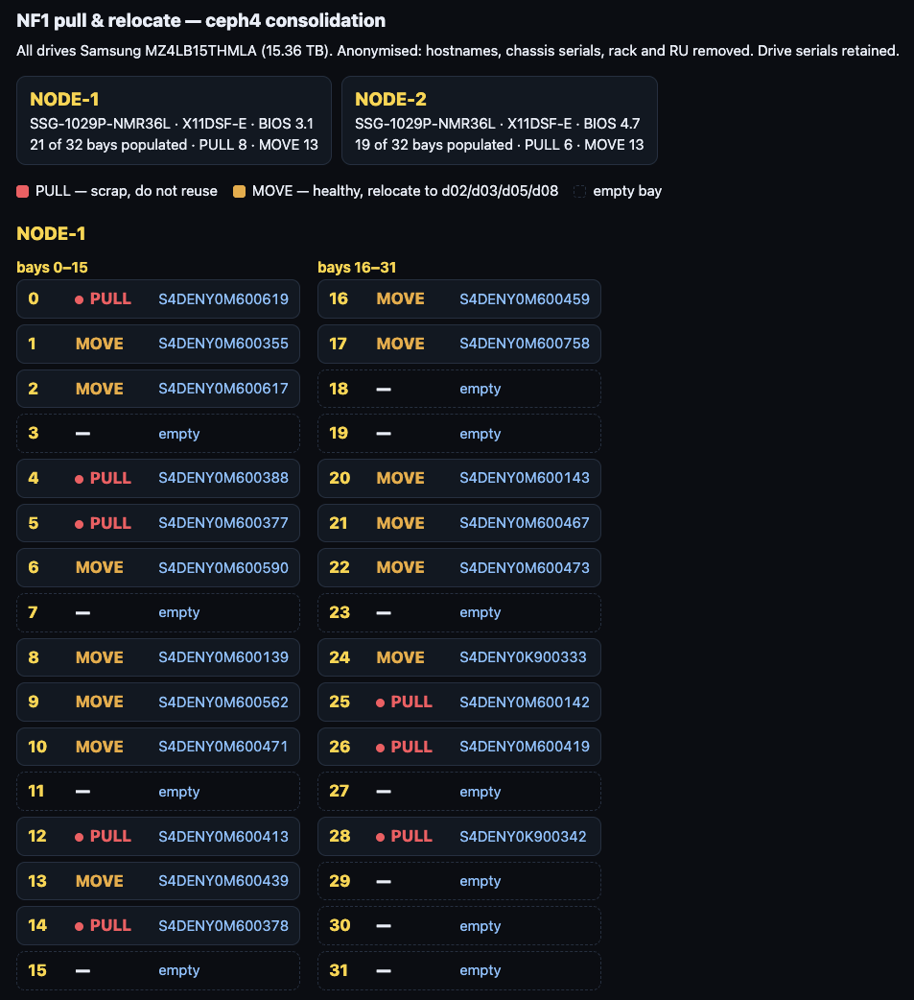
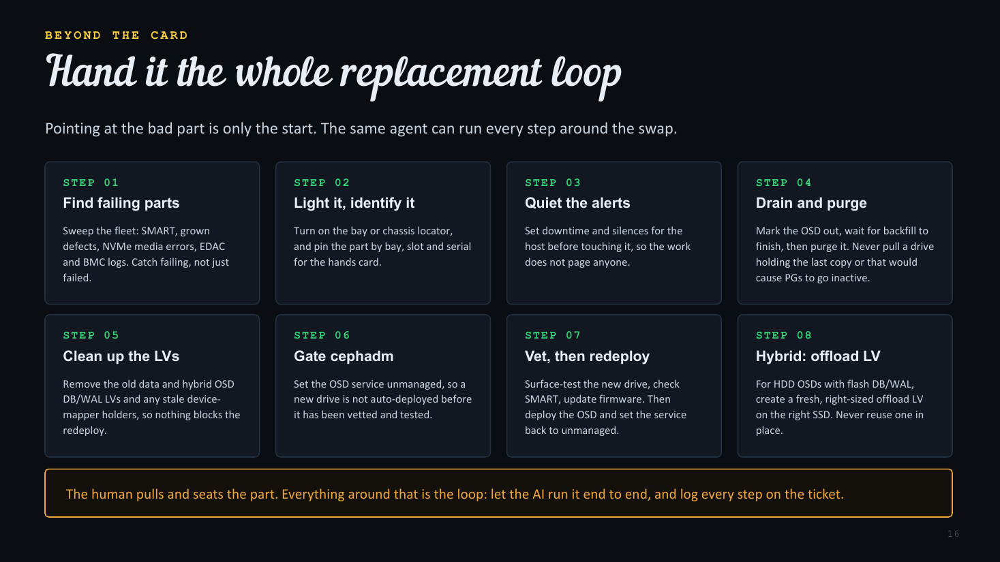
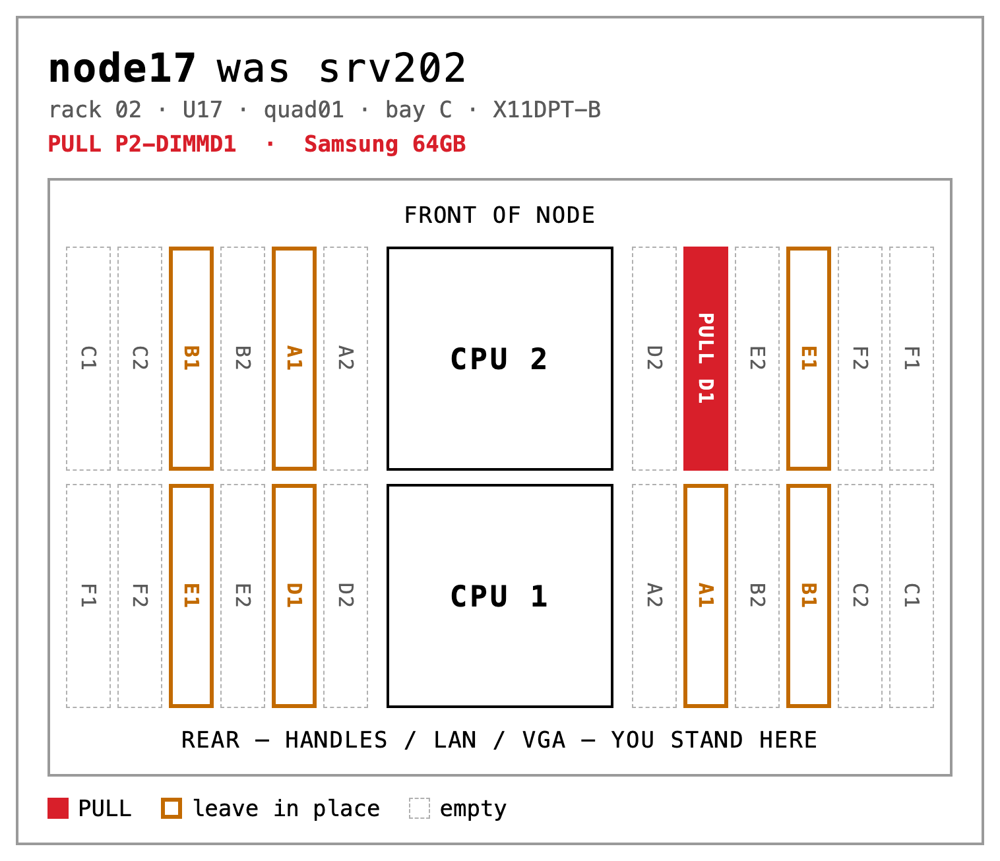

## You are not in the room

Ceph runs on hardware, and hardware breaks. DIMMs throw ECC errors,
drives grow defects, and sooner or later somebody has to walk into the
datacenter and put hands on a server. Increasingly that somebody is not
you: it is remote hands, the colo provider's technicians, or a teammate
at a site you will never visit.

The person at the rack cannot read your mind, your silkscreen, or your
inventory database. Everything you want done has to survive the trip
through a noisy room to someone who has never seen this chassis before.
This post is based on my talk at the September 2026 Ceph Tech Talk, and
its thesis is simple: remote hands is an interface problem, not a hardware
problem.

Every instruction you send crosses a gap, and the room is actively hostile
to communication:

* **Not your team.** Colo remote hands may be a shared pool. They may not have built this fleet and may not see it again tomorrow.
* **Hands are full.** A drive in one hand, a carrier in the other. They are not typing, and they are not scrolling.
* **It is loud.** Fan walls run 75 to 85 dBA. Hearing protection is PPE, not an option they can decline.
* **One shot.** Pull the wrong drive from a degraded pool and you are explaining an outage, not a swap.

These are competent people. The failure mode is not that the tech is
careless. It is that you sent an instruction only you could follow.

## Rule 1: Never use voice

Voice feels faster. It is the single most expensive shortcut in this whole
workflow.

Slot and device identifiers are the worst case for speech. They are
letter-digit strings with no linguistic context to correct against, so
they are easy to get wrong even in a quiet room:

* `P1-DIMMG1` versus `P1-DIMMD1`
* `bay 15` versus `bay 50`
* `slot B2` versus `slot D2`
* `sdb` versus `sdd`

And a datacenter is not a quiet room. Fan noise masks exactly the
consonants that separate B, D, E, G, P, T and V. Your tech is wearing ear
protection, and asking them to lift a muff is asking them to remove PPE in
the loudest room you own. There is no scrollback, no screenshot, and no
second read.

If it has to be said out loud, it is going to be said twice, and
confirmed wrong once.

## Rule 2: Move it to chat

Slack, or whatever they have. A chat channel is the only medium that is
synchronous and asynchronous at the same time, and the only one that
carries pictures back.

* **Both modes.** Sync when you are both there, async when you are not. They read it when they get to the cage; you answer when you wake up.
* **Inbound media.** "Is this the one?" with a photo settles in seconds what three paragraphs cannot. Video catches an intermittent LED or a fan you can hear.
* **Artifacts.** Link the manual page. Paste the grid. It is all still there at shift change.

It is also a record: timestamped, searchable, and attributable, for free.
When a drive turns up in the wrong bay three weeks later, the channel says
who put it there and what they were told.

## Rule 3: Reliable connectivity is a hard requirement

Everything above assumes the tech can reach you from where the hardware
is. In a colo, that assumption is frequently false, and not yours to fix.

Provider Wi-Fi coverage is designed for the office, not the cold aisle.
Cages are steel mesh, access points sit at the end of the row, and signal
dies exactly where the racks are. It is worst inside the cage you are
paying for. Cellular is no better: you are in a concrete box. You cannot
add an access point, move one, or open a ticket that gets triaged this
week, because the escalation path runs through your account manager, not
your NOC.

So plan around it. Confirm the tech has a working path before they are
standing at the rack, and hand them something that still works when the
link drops. This is the argument for paper, and for the printer we will
get to at the end: an instruction that has already arrived cannot go
offline.

## "Pull slot #11" is not an instruction

Remote hands may never have worked inside a server. Your shorthand
carries a mental model they were never given.

| What you send | What it quietly assumes |
|---|---|
| pull slot #11 | that "slot" means a drive bay here, and a PCIe slot two lines later |
| add DIMMs in P1-C1 and P2-C1 | that P1 is a CPU, that C is a channel, and that the board is labeled at all |
| reseat the riser | that they know which card is the riser, and that it lifts rather than slides |
| swap the drive in bay 6 | that bays are numbered the way you are counting them |

Every one of those assumptions is a place the job silently goes wrong, and
the tech will not know to ask. This is not a competence problem. These are
domain conventions, and nobody hands them to a contractor.

## The chassis will not help

Most boards and chassis do carry slot markings. Assuming a tech can find
and use them is a different claim entirely:

* **Covered.** DIMM slot names are routinely hidden under power and fan harnesses.
* **Hidden.** On some boards the air shroud has to come off before the markings are visible at all.
* **Ambiguous.** Silkscreen is low-contrast gray on green, 2 mm tall, in a dark rack, read from whichever side the rails let you stand on.

The practical consequence: anchor instructions to landmarks nobody has to
read. The CPU sockets, the front of the chassis, the rear I/O panel, the
handles. These are visible with the lid off, from across the aisle, under
a headlamp, and they do not depend on the tech finding 2 mm of gray text.
Use the slot name as confirmation, never as the address.

## Which one is bay 6?

Here is the ambiguity nobody warns you about. Same twelve bays, same front
panel, four legitimate numbering conventions.

*"Bay 6" is four different drives. Origin corner, index base and major axis all have to be stated, or shown.*

Vendors are not consistent, and it varies between a 1U and a 2U of the
same generation from the same vendor. On one 24-bay chassis I work with,
the front bank enumerates 0 through 11 column-major from the bottom left,
and nothing about the chassis tells you that. Confirm the convention with
a locator-LED pass on one node before a per-bay sheet goes out.

## And then there is depth

On a top-loading or dual-bank "missile launcher" chassis, the bay grid
runs front to back as well as side to side. "Third from the left" now has
two answers, and they are not equally safe to get wrong.

*Both highlighted bays are "third from the left." One is bay 2; the other is bay 14.*

The outer bank is front-panel hot-swap. The inner bank is a lid-off,
slide-the-node-out job: different risk, different time, different change
window. Name the bank every time, and say whether the lid comes off.

## A picture is worth 1024 bytes. Give them a K.

Everything so far is the same problem: you are encoding a physical
location as text, and they have to decode it standing in front of the
metal. Skip the encoding. Draw it.

* **No decoding.** A highlighted cell in the right place needs no convention, no index base, and no origin corner. There is nothing to get backwards.
* **Self-checking.** The shape of the grid, the position of the CPU, and which end the handles are on all have to match what is in front of them, or they stop and ask.
* **Teaches.** Print `P1-DIMMG1` on the cell anyway. It is the read-back check, and after three jobs the tech has learned the scheme for free.

This is the part AI makes cheap. Generating a correct, chassis-specific
diagram used to cost more than the maintenance was worth, so nobody did
it: they typed "bay 6" and hoped. A model that has read the manual can
draw the right grid, for the right chassis, with the right bay lit, in the
time it takes to open the ticket.

## In practice: memory

Show the board, not the slot name. Draw the DIMM slots where they
physically are, relative to the front of the chassis and to the CPU
sockets, and then label them.

*One red cell. Everything else is orientation.*

* **Orientation.** State which way they are standing: "FRONT OF NODE" up top, "REAR, YOU STAND HERE" below.
* **Landmarks.** Both CPU sockets drawn in place, in their real positions and at their real size.
* **Slot names.** `P2-DIMMD1` on the cell itself: verification now, and repetition that teaches the scheme.

At a typical 8-of-24 population, every pull reduces to something like
"CPU 2, left bank, the inner one of the pair," which is executable with no
labels at all. Say that in chat alongside the card.

A population plan is the same drawing with the action inverted: fill
these, leave those empty. Channel rules are decisions the tech should
never have to make at the rack.

*One action per cell, the population rule stated as an outcome, and the manual page it came from.*

Every generated card should name the manual and page it came from, so a
wrong layout is catchable.

## In practice: drives

Same treatment for drives: the real grid shape, in the real orientation,
with the one bay in question highlighted and everything else visibly
not-it.

*Light up the bay, not the sentence.*

* **One highlight.** Eleven calm cells and one red one. The eye finds it first.
* **Position in words too.** "Top-right of the front panel" catches the case where the picture printed in grayscale.
* **The read-back.** The grid finds the drive; the serial on the label proves it. Confirm the serial before pulling.

## Red means scrap

A single fault is the easy case. A real job often has two actions at once,
and in this one the difference between them is fourteen drives going in
the bin and twenty-six good ones going back into service.

*One of two nodes from a real consolidation. Drive serials kept so the tech can confirm; hostnames, chassis serials, rack and RU stripped.*

Reserve the red. Red is "this part is bad," and nothing else. Amber is
"healthy, and moving." Color those the same and twenty-six working 15 TB
drives go in the scrap bin. Say the action, not the state: a healthy drive
being relocated is not FAILED.

Enumerate every pull by bay, never by count and never by model. Hands
cannot see what is in a bay before they pull it, so "pull any 8" is not
executable. Eight bay numbers are.

## Make sure they are at the right chassis

Before any of that: a perfect bay diagram applied to the wrong server is
worse than no diagram at all. Now you have an outage and a confident tech.

Never trust the sticker. Adhesive labels go stale after a rename and fall
off in a hot aisle, and the failure mode is not that the label is missing.
It is that someone found it on the floor and stuck it back on the wrong
chassis. A label is a hint. It is never the identity.

Use these instead:

* **The locator LED.** Light it from your side, then ask what is blinking. It is the only identifier that cannot be moved by hand.
* **The chassis serial number.** Stamped or etched by the vendor, and the thing your inventory actually keys on. Have them read it back.

Lighting that LED is not one command. It varies by vendor, by system
model, and even across BIOS and BMC revisions on the same model: sysfs,
`ipmitool`, Redfish, or a vendor tool, each with its own spelling. This is
exactly the kind of fiddly, well-documented, per-model lookup to hand to
the AI. Let it work out how to light this box, rather than maintaining the
matrix yourself.

## Hand it the whole replacement loop

Pointing at the bad part is only the start. The same agent can run every
step around the swap:

1. **Find failing parts.** Sweep the fleet: SMART, grown defects, NVMe media errors, EDAC and BMC logs. Catch failing, not just failed.
2. **Light it, identify it.** Turn on the bay or chassis locator, and pin the part by bay, slot and serial for the hands card.
3. **Quiet the alerts.** Set downtime and silences for the host before touching it, so the work does not page anyone.
4. **Drain and purge.** Mark the OSD out, wait for backfill to finish, then purge it. Never pull a drive holding the last copy, or one whose removal would cause PGs to go inactive.
5. **Clean up the LVs.** Remove the old data LV, the DB/WAL LV of a hybrid OSD, and any stale device-mapper holders, so nothing blocks the redeploy.
6. **Gate cephadm.** Set the [OSD service](https://docs.ceph.com/en/latest/cephadm/services/osd/) unmanaged, so a new drive is not auto-deployed before it has been vetted and tested.
7. **Vet, then redeploy.** Surface-test the new drive, check SMART, update firmware. Then deploy the OSD and set the service back to unmanaged.
8. **Hybrid: offload LV.** For HDD OSDs with flash DB/WAL, create a fresh, right-sized offload LV on the right SSD. Never reuse one in place.

*The human pulls and seats the part. Everything around that is the loop.*

A recent example: an OSD was crash-looping on a 16 TB HDD that had grown
hundreds of defects. The agent silenced the alerts, purged the OSD, freed
its DB LV, lit the slot, and gated the OSD spec. When the replacement went
in, it wiped and surface-tested the drive and updated its firmware, then
deployed the new OSD with a fresh DB LV on the shared SSD. The human only
touched the drive. Let the AI run the loop end to end, and log every step
on the ticket.

## Distill the sources into a skill

None of this works if the model is guessing at geometry. Feed it the
documentation once, verify it, and it stops guessing. Four sources matter:

* **Vendor manuals.** User, maintenance and technical guides for every chassis and board in the fleet. The full manual, not the quick-reference guide: the QRG omits the low-count population rows.
* **Datasheets and spec sheets.** Bay counts, backplane topology, DIMM channel maps, supported ranks and speeds, riser options.
* **Labeled photos.** Vendor product shots, teardowns, review-site photography. A color photo of a bare board settles orientation questions a figure cannot.
* **What you learn in the field.** Every time hands correct you, that is a fact the manual did not have. Write it back into the skill.

Then verify before you trust it. Manual figures mirror silently: two label
lists running in opposite directions are both self-consistent, so a wrong
reading looks right. Confirm geometry against a live host (`dmidecode`,
SES slot enumeration) or a photograph of the real board, and pin the
result. Derive it once, carefully; reuse it forever.

## Know what works for your tech

The best card is the one this person will actually use. That is not a
property of the card. It is a property of the pairing, and you only learn
it by watching.

Some techs want the picture: rich graphics, color, board geometry. They
read spatially and never look at the legend; more words make it worse.
Others want the list: plain monospace text, 60 columns, no color. One tech
bounced off a beautifully rendered card entirely and asked for a bordered
text grid per host, with a two-column slot and action table. Same data, no
graphics.

The second preference only surfaced because a card came back unused. Ask,
or infer it from past friction with that specific person, and keep the
generator able to emit both formats from one dataset. Do not assume the
prettier artifact is the better one.

## Put an all-in-one printer in the datacenter

This is the unglamorous one, and the cheapest item in the whole workflow.
It is also the one people leave out. Put a printer in the datacenter, even
if the techs have to reach it over Bluetooth or the printer's own Wi-Fi.

*The same card in a print theme: white ground, one filled cell. Black backgrounds cost a fortune in ink.*

* **Hands full.** Paper is easier to carry than a phone. It goes in a pocket, under an arm, or on top of the chassis, and it does not lock, sleep, or need a clean finger.
* **No scrolling.** Few people have an 8½ × 11 phone. On paper the grid, the slot list and the confirmation note are in view together, which is exactly when a tech catches a mismatch.
* **Offline by default.** The one artifact that does not care whether the cage Wi-Fi is up. Print before they walk in, with a datestamp in big friendly red letters at the top of each page.

It earns its keep the rest of the time too: RMA paperwork, packing slips
and shipping labels are all best printed on site anyway, which is what
gets it approved on the expense line.

## Future work

* **Automate RMA processing.** When a drive failure is detected or predicted, create the vendor RMA. This is thorny, given flaky websites and byzantine RMA processes.
* **Unprompted hands task creation.** Periodically scan for failed and failing DIMMs and drives, turn on locators, and compose the task sheets before anyone asks.
* **Automate adhesive labels.** Print labels to a dedicated labeler or to Avery-style sheets.
* **Automate firmware updates.** Processes and tools vary across manufacturers. Let the AI worry about the nitty-gritty.

## What to actually change on Monday

1. **Move remote hands off the phone and into a chat channel.** Bidirectional media, scrollback, and a record you did not have to write.
2. **Check connectivity before the window, and print a copy anyway.** Cage Wi-Fi is marginal, and it is not yours to fix.
3. **Never send a bare slot or bay number.** Index base, major axis, origin corner and bank are all unstated, and all variable.
4. **Send a picture, and keep red for what does not come back.** Orientation, landmarks, slot name on the cell, and a separate color for parts that are only moving.
5. **Identify the chassis by locator LED and serial, never a sticker.** Let the AI work out how to light that particular model.
6. **Distill the manuals into a skill, then verify the geometry.** Figures mirror silently. Confirm against a live host or a photo, then pin it.
7. **Match the format to the technician, and put a printer in the DC.** The best card is the one they will use. Paper also covers RMAs and shipping labels.

If you remember one thing, make it this: the diagram is cheap now, and
the text instruction never worked.

A picture is worth 1024 bytes. Give them a K.

## About the author, Anthony D'Atri

* Ceph at scale since 2014
* (Successfully since 2017)
* Ceph Ambassador
* Ceph Documentation Lead
* Author: _Learning Ceph, Second Edition_
* QLC fanboy
* Ceph is quite graphically a part of me
