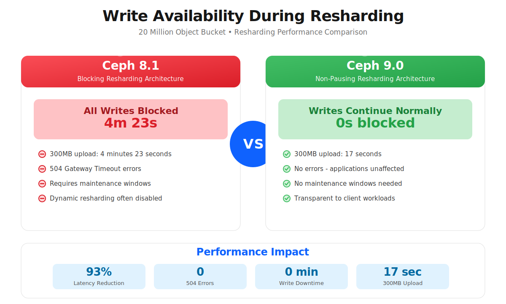

## Introduction: The Foundation of Scalable Object Storage

In the modern data landscape, object storage has evolved from a simple file
repository into the foundational layer for AI/ML pipelines, data lakehouses,
real-time analytics, and massive-scale archival systems. At the heart of this
evolution is a deceptively simple
question: **How do you efficiently locate and access billions of objects stored in a single bucket?**

The answer lies in one of Ceph's most critical performance
mechanisms: **bucket index sharding**. This architectural
pattern divides a bucket's index into multiple parallel structures, enabling
concurrent operations across thousands of objects while maintaining the
consistency and reliability that enterprise workloads demand.

But there's always been a catch. As workloads grow and evolve, buckets need
to be resharded. Historically, when the buckets to be resharded had a vast
number of objects, this operation came with a painful trade-off: blocking
client writes from seconds to minutes, with a chance of causing application
disruptions, 504 Gateway errors, and operational headaches.

With Ceph Tentacle, we're eliminating this trade-off. The new near-zero
impact bucket resharding architecture transforms what was once a
maintenance window event into a seamless background operation
that your applications will never notice.

Note: As of 2026/02/05, the functionality described in this article is expected
in an upcoming Tentacle update.


### Executive Summary

**The Challenge**: In Ceph Squid, resharding a 20-million-object bucket blocked
writes for 4+ minutes, returning 504 errors. Even larger buckets (500M objects)
required 94 minutes of complete write unavailability.

**The Solution**: Ceph Tentacle's two-phase architecture moves the heavy lifting to a non-blocking background phase, eliminating the impact on clients IO.

**The Results**:



(note: in this graphic 8.1 refers to Squid and 9.0 to Tentacle)

In this deep dive, we'll explore:

1. Why bucket sharding is essential for modern workloads
    
2. The challenges of resharding in Ceph Squid and earlier versions
    
3. The enhanced two-phase architecture in Ceph Tentacle
    
4. Before/after performance comparison from production testing
    
5. The future of bucket indexing with in-order sharding
    

## The Scalability Enabler: Understanding Bucket Index Sharding

### The Bucket Index and omaps

In Ceph's Object Gateway(RGW), the ability to list bucket contents is fundamental
to object storage operations. The Object Gateway(RGW) implements this using a
dedicated structure called the bucket index, which maintains an inventory of
all objects in a bucket. This index is stored using a special RADOS feature
called the Object Map (omap) - essentially a key-value store associated with a
RADOS object, physically residing in the RocksDB database on each OSD's DB partition.

Without sharding, a bucket's entire index is stored in a single RADOS object.
While elegant in its simplicity, this creates a fundamental performance problem:

The Single-Index Bottleneck: Since only one operation can modify this index at
a time, you're looking at complete serialization. Write operations must queue
and wait their turn to update the index. As your bucket grows to millions of
objects with thousands of concurrent write operations, this serialization
becomes a severe bottleneck.

Think of it like a busy airport with only one runway. No matter how many planes
are waiting to land, only one can touch down at a time.

### Sharding: Parallelism Through Distribution

**Bucket index sharding** solves this bottleneck by dividing the index into
multiple parts (shards), with each shard stored as a separate RADOS object
within the `.rgw.buckets.index` pool. When an object is written, the Ceph
Object Gateway (RGW) calculates a hash of the object's name to determine
which shard should receive the index update. This enables multiple operations
to run concurrently across multiple Placement Groups (PGs), distributing
requests among the the OSDs that host the index pool.

Returning to our airport analogy: you now have multiple runways, each handling
different aircraft simultaneously. The more runways (shards) you have, the more
parallel operations you can support.

The sharding mechanism uses the `rgw_max_objs_per_shard` tunable (default:
100,000 objects per shard) to determine optimal distribution.

We recommend maintaining no more than 102,400 objects per shard for optimal performance.

### Why Single-Bucket Scale is Mission-Critical in Modern Object Workloads

Here's where bucket sharding becomes even more critical: modern analytics
architectures are converging on single-bucket designs.

**The Data Lakehouse Pattern**

Apache Iceberg, Apache Hudi, and Delta Lake (the table formats revolutionizing
data architecture) organize petabytes of data within a single bucket using
hierarchical prefixes:

```bash
s3://analytics-lakehouse/
├── warehouse/
│   ├── sales_db/
│   │   └── transactions/
│   │       ├── data/
│   │       │   ├── year=2025/month=11/
│   │       │   │   ├── 00045-23-a1b2c3d4.parquet
│   │       │   │   └── 00046-24-e5f6g7h8.parquet
│   │       │   └── year=2025/month=10/
│   │       └── metadata/
│   │           ├── v1.metadata.json
│   │           ├── v2.metadata.json
│   │           └── snap-1234567890.avro
│   └── customer_db/
│       └── profiles/
├── staging/
└── archive/
```

**The implication?** Modern data platforms need buckets that can:

* Scale to billions of objects distributed across thousands of prefixes
    
* Handle mixed workloads: batch ETL, interactive queries, real-time streaming
    
* Adapt dynamically to growth and contraction without downtime
    
* Maintain sub-second listing performance across massive object counts
    

This is precisely where seamless resharding becomes absolutely critical.

## The Challenge: Resharding in Ceph Squid and Earlier

Understanding the improvements in Ceph Tentacle requires understanding the challenges of the previous approach.

### The Blocking Resharding Process

In Ceph Squid and earlier versions, bucket resharding followed this process:

1. Resharding operation initiates (manually or via dynamic resharding)
    
2. All client write operations are blocked to the bucket
    
3. Index entries are copied from source shards to destination shards
    
4. Applications receive 504 Gateway Timeout errors
    
5. Operations teams monitor progress
    

In buckets with small object counts, resharding is almost unnoticeable, but as
object counts grow, the write pause can last from minutes to hours, depending
on bucket size. Read operations continued, but write unavailability required
careful planning for production workloads.

### The Operational Impact

This blocking behavior created several operational constraints:

**Maintenance Windows**: Resharding typically requires scheduling during off-peak
hours with advance notification to application teams.

**Capacity Planning Tradeoffs**: Teams set high initial shard counts based on
pre-sharding usage estimates for the bucket, but these are hard to calculate up front.

**Dynamic Resharding Concerns**: Automatic reshards could trigger during peak
business hours, potentially causing disruptions. Some organizations disabled dynamic resharding entirely and managed sharding manually.

Ceph Tentacle addresses these challenges with a fundamentally different approach.


## The Solution: Non-Pausing Resharding in Ceph Tentacle

Now let's explore what changes in Ceph Tentacle - and why it's transformational.

### Reshard Two-Phase Architecture


The Ceph Object Gateway(RGW) engineering team fundamentally redesigned the resharding
process from the ground up. Instead of blocking all writes while copying index entries,
Ceph Tentacle introduces an intelligent two-phase incremental approach that keeps your
applications running:

**Phase 1: Log Record Phase (Non-Blocking)**

During this phase, which comprises the bulk of the resharding operation:

* **Client writes continue normally** - no blocking whatsoever
    
* **Index operations are logged** to source shards alongside regular write operations
    
* **Background migration begins** - existing index entries start copying to destination shards
    
* **Change tracking** - a sophisticated logging mechanism captures all modifications
    

**Phase 2: Progress Phase (Minimal Pause, zero client impact)**

Only after the bulk of entries have been migrated does Phase 2 begin:

* **Brief write pause** - With zero client impact (milliseconds to low seconds)
    
* **Log synchronization** - recent changes recorded during Phase 1 are applied to destination shards
    
* **Conflict resolution** - entries modified during migration are reconciled
    
* **Bucket stats recalculation** - metadata is updated to reflect the new shard layout
    
* **Cutover** - bucket switches to the new index layout
    
* **Normal operations resume**
    

**The Key Innovation:** By recording changes as lightweight logs during Phase 1,
the system only needs to synchronize recent modifications during the brief Phase
2 pause. The bulk of the work - migrating millions of existing entries - happens
entirely in the background while your applications continue writing uninterrupted.

**Backward Compatibility:** Ceph Tentacle's resharding maintains compatibility
as a superset of the previous implementation. If some OSD nodes haven't yet
upgraded, resharding safely fails rather than risking data loss, and the
system checks version compatibility before proceeding.

### What This Means For Your Operations

The practical implications extend far beyond eliminating 504 errors:

**1. Eliminate Maintenance Windows.** No more scheduling resharding operations for 2 AM on Sunday. Trigger reshards during peak business hours if needed - your applications won't notice.

**2. Enable True Dynamic Scaling**  
Dynamic bucket resharding can now be fully trusted. The automation you've wanted - automatic scaling up and down with minimal client interruption.

**3. Production Confidence.** Deploy resharding changes without coordination, without warning application teams, without anxiety. It just works.

**4. Faster Response to Demand.** Workload explodes? Trigger an immediate upshard. No more waiting for a maintenance window.

**5. Simplified Operations.** One less thing requiring complex runbooks, escalation procedures, and off-hours coordination. Focus on value-add activities instead.

## Performance Comparison: Before and After

To validate the architectural improvements, we conducted extensive testing
comparing Ceph Squid and Tentacle under identical conditions. The results
demonstrate the transformational impact of near-zero impact resharding resharding.

### Test Scenario: Small-Scale Bucket with 20 Million Objects

**Configuration:**

* **Environment**: Single-site deployment using `s3cmd`
    
* **Bucket size**: ~20 million objects
    
* **Resharding operation**: Manual upshard (401 → 10,001 shards for 8.1, 307 → 10,001 for 9.0)
    
* **Test action**: Upload a 300MB object during active reshard
    

**Results:**


**The Impact:** Uploads that previously required 4+ minutes due to complete blocking
now complete in 17 seconds for 300MB objects, with zero errors. That's a 93% reduction
in client-perceived latency - or more accurately, the elimination of the problem entirely.

From an application perspective, resharding is now completely transparent. Your
applications continue serving requests without any indication that a major
infrastructure operation is happening beneath them.

### Test Scenario: Medium-Scale Bucket with 500 Million Objects

For larger buckets, the improvements are even more dramatic.

**Test Methodology Note**: This test was deliberately conducted as a stress
scenario to evaluate behavior under extreme conditions. The cluster was pushed
to near-saturation with concurrent large-object uploads during resharding
operations. This aggressive test configuration amplifies resharding times
significantly beyond typical production scenarios, allowing us to validate
the improvements under worst-case conditions.

**Configuration:**

* **Environment**: Single-site deployment using s3cmd
    
* **Test**: Upload 300MB and 1GB objects during downshard operation
    
* **Resharding operation**: Downshard from 10,001 → 1,999 shards
    
* **Load**: Concurrent large uploads pushing cluster toward capacity limits
    

**The Results:**


**The Impact:** While typical production resharding in Ceph Squid would
complete faster than the 94 minutes shown here, this stress test reveals
critical behavior differences. Under load, Ceph Squid's blocking architecture
creates cascading issues - the longer the reshard takes, the longer
applications are blocked, potentially triggering timeouts and retry
storms. Ceph Tentacle's non-blocking architecture eliminates this
entire failure mode. Whether resharding takes 10 minutes or 90 minutes,
applications continue operating normally.

### At a Glance: The Transformation

| **Aspect** | **Ceph Squid** | **Ceph Tentacle** |
| --- | --- | --- |
| **Client Impact** | Complete write blocking | Zero write blocking |
| **Error Rate** | 504 Gateway errors | No errors |
| **20M Object Upshard** | 4m23s blocked | 17s upload (no pause) |
| **500M Object Downshard** | 94 minutes blocked | 5-17s uploads (no pause) |
| **Maintenance Window** | Required | Not required |
| **Dynamic Resharding** | Often disabled | Enabled |

## Looking Forward: The Future of Bucket Indexing

The near-zero-impact bucket resharding feature in Ceph Tentacle is
transformational, but it's part of a broader evolution in how Ceph
handles bucket indexing at scale.

### In-Order Sharding: The Next Frontier

Currently, RGW's hashed sharding optimizes for write distribution but presents
challenges for alphabetical listing operations. To fulfill a paginated list
request, RGW must perform a "scatter-gather" operation: querying every shard
and sorting the combined results. For buckets with thousands of shards, this
becomes a bottleneck.

**In-order sharding** (ordered bucket listing) is in active development and will revolutionize listing performance:

**The Change**: Instead of using a hash function, objects will be placed into shards based on lexicographical name ordering.

**The Impact**:

* List requests can target specific shard ranges instead of querying all shards.
    
* Paginated listing becomes dramatically faster (query 1-2 shards instead of thousands).
    
* Prefix-based queries (critical for data lakehouses) become highly efficient.
    
* Iterating through object keys becomes significantly more performant.
    

**Why This Matters for Data Lakehouses:**

Apache Iceberg, Hudi, and Delta Lake all rely heavily on prefix-based object discovery:

```bash
s3://lakehouse/warehouse/sales_db/transactions/data/year=2025/month=11/
```

With in-order sharding, a query for this prefix would hit only the specific
shards containing objects in that lexicographical range - not all 10,000 shards in the bucket.

Combined with non-pausing resharding, Ceph is building toward virtually unlimited,
performant scalability within a single bucket - exactly what modern data platforms demand.

For a detailed slide deck on the topic, check out
[Eric](https://cephalocon2025.sched.com/speaker/ivancich) Ivancich's excellent Cephalocon talk:

[Video](https://www.youtube.com/watch?v=H-CRhw3XLGw)

[Slides](https://static.sched.com/hosted_files/cephalocon2025/80/Cephalocon%202025%20Ivancich.pdf?_gl=1*153a8oy*_gcl_au*MTgwNzY1MDQ2MC4xNzU4MjA2ODAy*FPAU*MTgwNzY1MDQ2MC4xNzU4MjA2ODAy)

## Conclusion: A New Era of Operational Excellence

Ceph Tentacle's near-zero impact bucket resharding represents a
fundamental shift in production object storage operations,
eliminating one of the most significant pain points in large-scale deployments.

As Ceph continues evolving with features like in-order sharding, the vision
becomes clear: **single-bucket architectures that scale infinitely without operational complexity**.

For data lakehouse architects building on Apache Iceberg, for AI/ML engineers
managing billions of training artifacts, and for enterprise architects demanding
the highest availability without operational friction, Ceph Tentacle
delivers the operational maturity that production workloads require.

*All test configurations were performed on HDD production-equivalent hardware.
Results may vary based on hardware specifications, network topology, and workload
characteristics. Consult the official documentation for detailed configuration guidance and best practices.

We would like to thank IBM for the time to author these articles. 