Modern cloud-native applications increasingly rely on **event-driven architectures** — systems that react to changes in real time rather than polling for updates. Ceph's RADOS Gateway (RGW), the S3-compatible object storage layer in Ceph, supports **Bucket Notifications**, a powerful mechanism to push event information to external endpoints whenever objects are created, modified, or deleted in a bucket.

This blog post dives deep into how Ceph RGW bucket notifications work, what events you can subscribe to, how filters allow fine-grained control, and how the Ceph Dashboard UI makes managing notifications easier than ever.

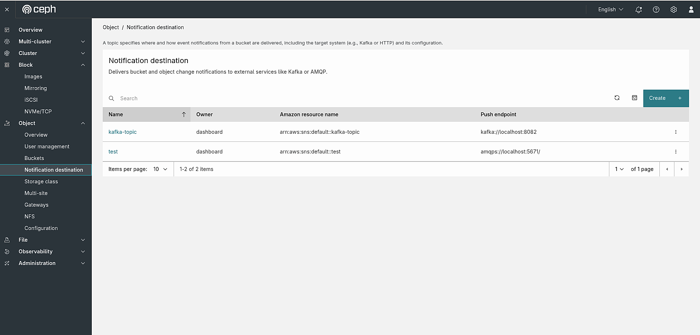

## What Are Bucket Notifications?

### Fundamental Concepts

- Bucket Notifications allow an S3 bucket to **automatically publish event data** to configured destinations (called _topics_) whenever specific operations occur on objects inside that bucket. This is the same model used by AWS S3 event notifications — and Ceph RGW implements a compatible API.

- The core workflow looks like this:

```
  Object operation (PUT/DELETE/COPY)
        │
        ▼
  Ceph RGW Bucket
        │  (matches event + filters)
        ▼
  Notification Topic (AMQP / Kafka / HTTP)
        │
        ▼
  External Consumer / Microservice
```

- **Image processing pipelines** — trigger a Lambda/worker when a new image is uploaded
- **Data ingestion** — notify a Kafka consumer when a new dataset file arrives.
- **Audit and compliance** — log every object deletion event to an external SIEM
- **Cache invalidation** — invalidate CDN cache when an asset is overwritten

Now let's see how we can configure and set up a topic with the step-by-step guide below.

## 1. Creating a Notification Destination

Before you can attach a notification to a bucket, you need to create a **Topic** — the destination endpoint that receives the event data.

The Ceph Dashboard supports three types of topic endpoints :

| Endpoint Type  | Protocol   | Description                            |
| -------------- | ---------- | -------------------------------------- |
| **AMQP**       | `amqp://`  | RabbitMQ or any AMQP-compatible broker |
| **Kafka**      | `kafka://` | Apache Kafka topics                    |
| **HTTP/HTTPS** | `http://`  | Any webhook-compatible HTTP endpoint   |

Topics are created using the AWS SNS-compatible API exposed by RGW (`POST /` with `Action=CreateTopic`), or through the Ceph Dashboard's **Notification destination** management interface.

To get started, navigate to **Object → Notification destination** in the Ceph Dashboard sidebar. This page lists all existing notification destinations and allows you to create new ones.

Click the **Create** button in the top-right corner. You'll be prompted to fill in the following fields:

- **Name**: A unique identifier for this destination (e.g., `kafka-topic`).
- **Owner**: The RGW user who owns this topic (e.g., `dashboard`).
- **Type**: The push endpoint type — supported options include **Kafka**, **AMQP**, and **HTTP**.
- **Push endpoint**: The URL of the external service that will receive the notifications (e.g., `https://localhost:443`).

Once submitted, the new destination will appear in the table with its **Name**, **Owner**, **Amazon resource name** (ARN, auto-generated in the format `arn:aws:sns:default::<name>`), and **Push endpoint**.

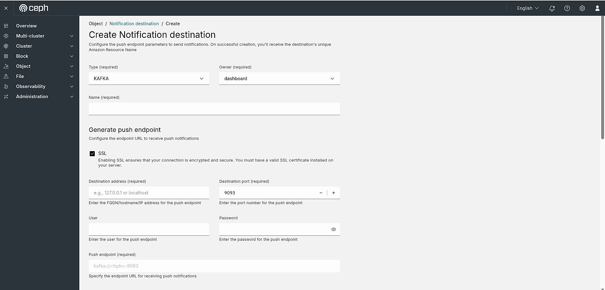
_Figure: Step 1 - Filling in the basic fields (Type, Owner, Name) and configuring the push endpoint._

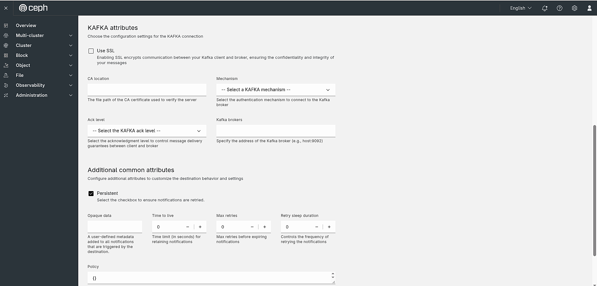
_Figure: Step 2 - Configuring endpoint-specific attributes (e.g., Kafka brokers, SSL, ACK level)._

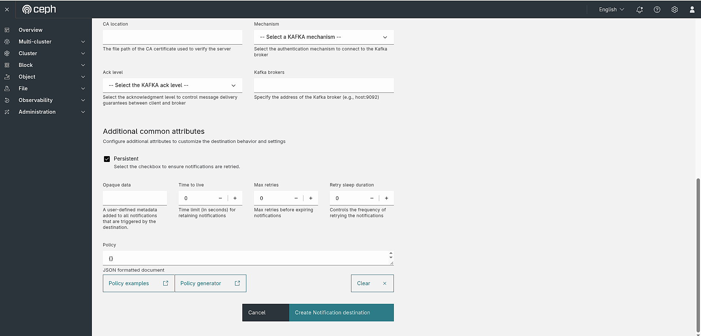
_Figure: Step 3 - Setting additional common attributes (Persistent, TTL, Max retries) and submitting._

## 2. Exploring the Notification Destination Detail View

Once a notification destination is created, you can click on its name in the list to open its **detail view**. The detail page for a topic (e.g., `kafka-topic`) is organized into three tabs:

- **Overview** — shows the topic's core properties (name, owner, push endpoint, ARN).
- **Policies** — lists the bucket notification policies that reference this topic.
- **Subscribed buckets** — lists all buckets that have an active notification linked to this destination.

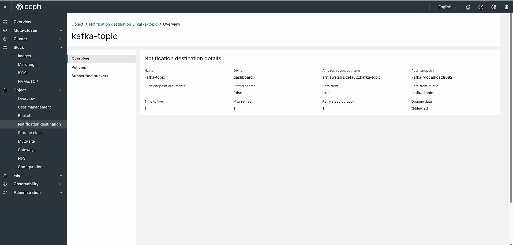
_Figure: Detail view of `kafka-topic` showing the Overview, Policies, and Subscribed buckets tabs._

### Policies Tab

The **Policies** tab displays the notification policies currently associated with this topic. Each row shows a **Key** and its corresponding **Value**.

At this point, since no bucket notifications have been configured yet, the `Policy` field shows `{}` — an empty JSON object indicating that no notification rules have been attached to this destination yet.

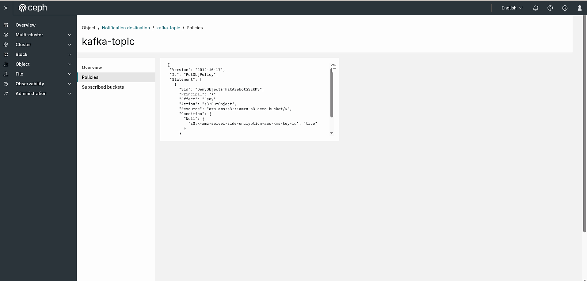
_Figure: Step 2 - Policies tab for `kafka-topic` showing no bucket notifications configured yet._

### Subscribed Buckets Tab

The **Subscribed buckets** tab shows which buckets are actively sending event notifications to this destination. Similar to the Policies tab, this list will be empty until a bucket notification is created and linked to this topic.

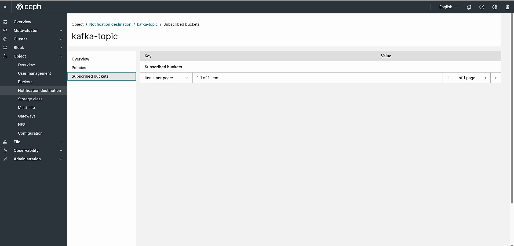
_Figure: Step 2 - Subscribed buckets tab for `kafka-topic` showing no buckets subscribed yet._

Both tabs will populate automatically once you configure a bucket notification that references this destination in the next step.

## 2.1 Managing a Notification Destination

In addition to creating notification destinations, the Ceph Dashboard also lets you **edit** and **delete** them at any time from the **Object → Notification destination** list page.

### Editing a Notification Destination

To edit an existing destination, click the **⋮** action menu on the right side of the destination row and select **Edit**. This opens the **Edit Notification destination** form, which is pre-populated with the current values and exposes the full set of configuration options:

**Basic fields** (read-only after creation):

- **Type** — the endpoint protocol: `HTTP`, `Kafka`, or `AMQP`.
- **Owner** — the RGW user that owns this topic (e.g., `dashboard`).
- **Name** — the unique topic name (e.g., `kafka-topic`).

**Generate push endpoint** — builds the push endpoint URL from individual components:

- **SSL** — enable HTTPS for the connection.
- **Verify SSL** — enforce server certificate validation (requires a valid SSL certificate).
- **Cloud events** — capture cloud events as triggers for notifications.
- **Destination address** — the FQDN or IP of the target service (e.g., `localhost`).
- **Destination port** — the port number (e.g., `9082`); the final **Push endpoint** URL is assembled automatically (e.g., `https://localhost:9082`).

**Additional common attributes** — fine-tune delivery behaviour:

- **Persistent** — when checked, notifications are retried if the destination is temporarily unreachable.
- **Opaque data** — user-defined metadata attached to every notification sent by this destination.
- **Time to live** — time limit in seconds for retaining undelivered notifications.
- **Max retries** — maximum number of delivery attempts before a notification is discarded.
- **Retry sleep duration** — delay in seconds between consecutive retry attempts.
- **Policy** — a JSON-formatted access policy document for this topic. Use the **Policy examples** or **Policy generator** links to build a valid policy.

Once you have made your changes, click **Edit Notification destination** to save them.

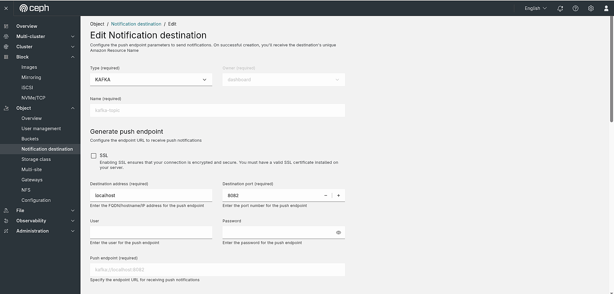
_Figure: Edit Notification destination form — basic fields and Generate push endpoint section for `kafka-topic`._

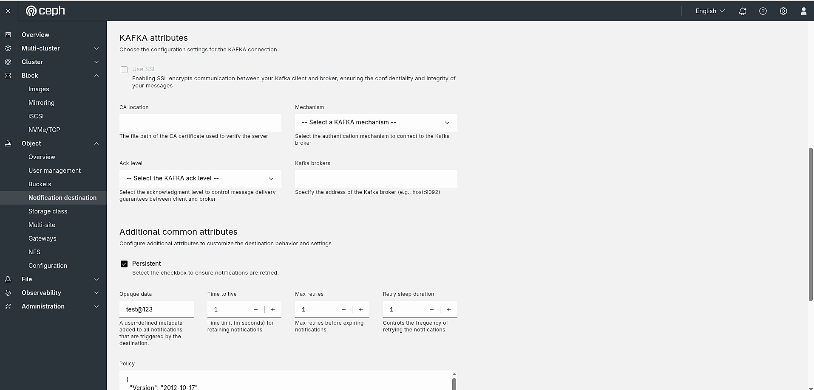
_Figure: Edit Notification destination form — endpoint-specific attributes (Kafka/AMQP/HTTP) section._

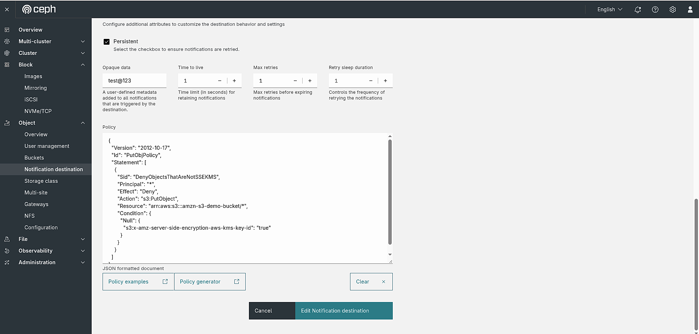
_Figure: Edit Notification destination form — Additional common attributes (Persistent, TTL, Max retries, Policy)._

### Deleting a Notification Destination

To delete a destination, click the **⋮** action menu on the destination row and select **Delete**. A confirmation dialog will appear asking:

> **Delete Notification destination**
> Are you sure that you want to delete **kafka-topic**?

The **Delete Notification destination** button is intentionally disabled until you check the **"Yes, I am sure."** checkbox — this two-step confirmation prevents accidental deletion. Once checked, the button turns red and becomes active. Click it to permanently remove the destination.

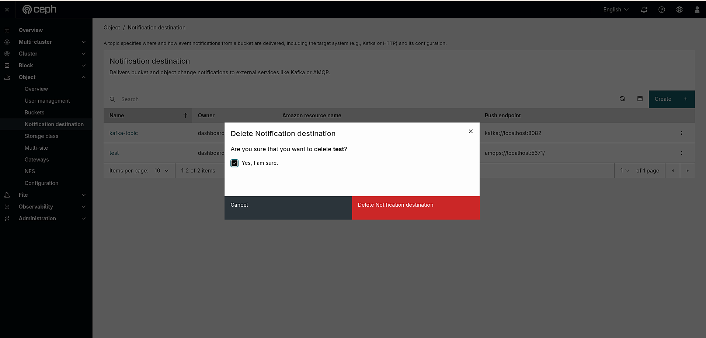
_Figure: Delete Notification destination confirmation dialog for `kafka-topic`, requiring the "Yes, I am sure." checkbox before the Delete button activates._

> **Note:** Deleting a notification destination does not automatically remove bucket notifications that reference it. Make sure no active bucket notifications are using this topic before deleting it, otherwise those notifications will silently fail.

## 3. Notification Configuration

With the notification destination created, the next step is to attach a **Notification configuration** to a specific bucket. This wires a bucket's object events to the topic so that RGW will push a notification every time a matching event occurs.

Navigate to **Object → Buckets**, click on the bucket name (e.g., `testbucket`), and select the **Notifications** tab in the left sidebar. Click the **Create** button to open the **Create Notification configuration** dialog.

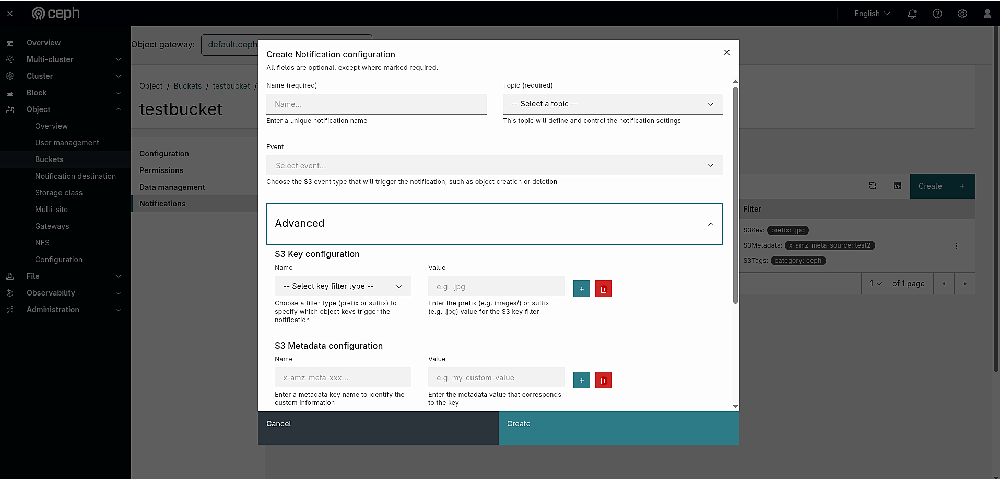
_Figure: Create Notification configuration dialog for `testbucket`, showing the Name, Topic, Event, and Advanced filter fields._

> All fields are optional, except where marked required.

### Required Fields

| Field     | Description                                                                                                                          |
| --------- | ------------------------------------------------------------------------------------------------------------------------------------ |
| **Name**  | A unique name for this notification configuration.                                                                                   |
| **Topic** | Select the notification destination (topic) that will receive the events. This topic defines and controls the notification settings. |

### Event

| Field     | Description                                                                                                                                    |
| --------- | ---------------------------------------------------------------------------------------------------------------------------------------------- |
| **Event** | Choose the S3 event type that will trigger this notification (e.g., object creation, object deletion). Leave empty to receive all event types. |

### Advanced Filters

Expand the **Advanced** section to apply fine-grained filters that control which specific objects trigger the notification. All filter fields accept multiple entries using the **+** button.

#### S3 Key Configuration

Filters notifications by object key name using a **prefix** or **suffix** match.

| Field     | Description                                                                                                   |
| --------- | ------------------------------------------------------------------------------------------------------------- |
| **Name**  | Select the filter type — `prefix` to match the start of the key, or `suffix` to match the end (e.g., `.jpg`). |
| **Value** | The prefix or suffix value to match against object keys (e.g., `images/` for a prefix, `.jpg` for a suffix).  |

#### S3 Metadata Configuration

Filters notifications based on custom object metadata headers.

| Field     | Description                                             |
| --------- | ------------------------------------------------------- |
| **Name**  | The metadata key name (e.g., `x-amz-meta-environment`). |
| **Value** | The metadata value to match (e.g., `my-custom-value`).  |

#### S3 Tags Configuration

Filters notifications based on object tags.

| Field     | Description                                   |
| --------- | --------------------------------------------- |
| **Name**  | The tag key to match (e.g., `backup-status`). |
| **Value** | The tag value to match (e.g., `completed`).   |

Click **Create** to save the notification configuration. Once created, it will appear in the **Notifications** table for that bucket with the following columns:

| Column          | Description                                                                            |
| --------------- | -------------------------------------------------------------------------------------- |
| **Name**        | The unique name of this notification configuration.                                    |
| **Destination** | The ARN of the topic that receives the events (e.g., `arn:aws:sns:default::test`).     |
| **Event**       | The S3 event type badge (e.g., `s3:ObjectCreated:*`). Empty means all events.          |
| **Filter**      | A summary of the active S3 key, metadata, or tag filters (e.g., `S3Key: prefix .jpg`). |

RGW will now forward events matching the configured event type and filters to the selected topic.

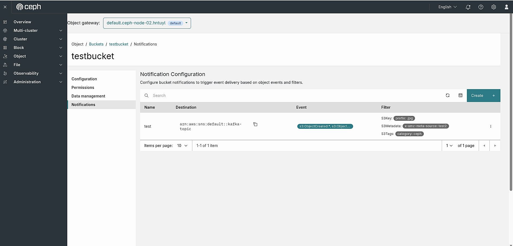
_Figure: Step 3 - Notification Configuration table for `testbucket` showing the created notification `test` targeting `arn:aws:sns:default::test` with event `s3:ObjectCreated:*` and S3 key prefix filter `.jpg`._

### Editing a Notification Configuration

To update an existing notification, click the **⋮** action menu at the end of the notification row and select **Edit**. The **Edit Notification configuration** dialog opens pre-populated with the current settings — the same form used during creation, with all fields editable except **Name** (which is fixed after creation).

The pre-filled values reflect what was configured at creation time:

- **Name** — read-only; the unique notification name (e.g., `test`).
- **Topic** — the currently linked topic ARN (e.g., `arn:aws:sns:default::test`); can be changed to redirect events to a different destination.
- **Event** — the event type filter; can be updated or cleared to match all events.
- **Advanced filters** — all S3 Key, Metadata, and Tags filter rules are shown and fully editable. For example, an existing S3 Key filter of `prefix: .jpg` will be displayed and can be modified or removed.

Click **Edit** to save the changes. The Notifications table will immediately reflect the updated destination, event, and filter values.

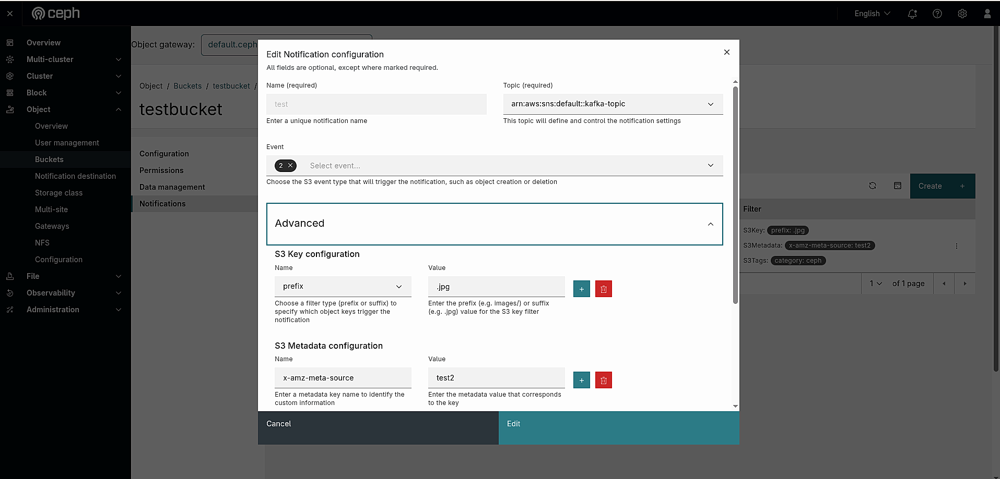
_Figure: Edit Notification configuration dialog for `test` — Name (read-only), Topic, and Event fields pre-populated._

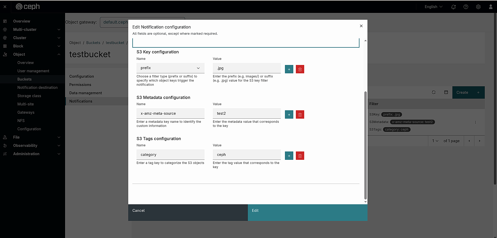
_Figure: Edit Notification configuration dialog for `test` — Advanced filters section showing the pre-populated S3 Key filter (`prefix: .jpg`)._

### Deleting a Notification Configuration

To remove a notification from a bucket, click the **⋮** action menu on the notification row and select **Delete**. A confirmation dialog will appear:

> **Delete Notification**
> Are you sure that you want to delete **test**?

The **Delete Notification** button remains disabled until you check the **"Yes, I am sure."** checkbox. This two-step confirmation prevents accidental deletion. Once checked, the button becomes active — click it to permanently remove the notification configuration from the bucket.

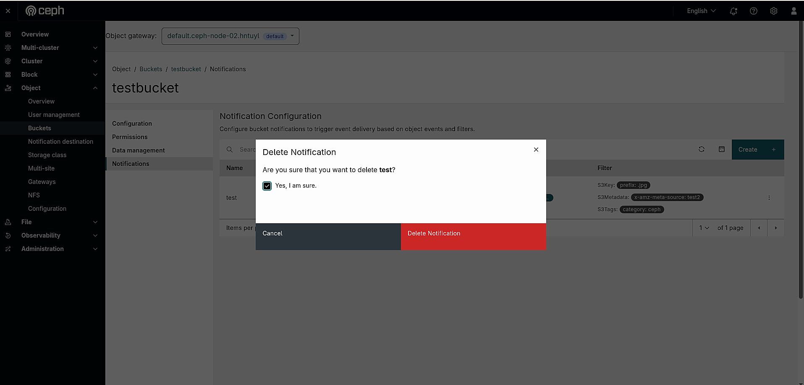
_Figure: Delete Notification confirmation dialog for `test`, showing the required acknowledgement checkbox before deletion can proceed._

## Key Features of the Dashboard for Notification Destination (Topic) and Notification

The Ceph Dashboard provides a comprehensive, UI-driven interface for managing the full lifecycle of RGW bucket notifications — from creating topics to attaching notifications to buckets and monitoring which buckets are subscribed. Here are the key features:

### 1. Multi-Protocol Topic Support

Create notification destinations for all three supported endpoint types — **AMQP**, **Kafka**, and **HTTP/HTTPS** — directly from the Dashboard without touching the command line. Each endpoint type exposes its own type-specific attributes (e.g., AMQP exchange, Kafka brokers, SSL settings) alongside a shared set of delivery controls (Persistent, TTL, Max retries, Retry sleep duration).

### 2. Guided Push Endpoint Builder

Instead of manually constructing endpoint URLs, the **Generate push endpoint** section assembles the final push endpoint URL automatically from individual fields (destination address, port, SSL toggle). This reduces URL formatting errors and makes configuration accessible to users unfamiliar with broker URL syntax.

### 3. Fine-Grained Event Filtering

The **Create Notification configuration** dialog supports three independent filter dimensions that can be combined to precisely control which object events trigger a notification:

- **S3 Key filters** — match object keys by prefix or suffix (e.g., only `.jpg` files, or only objects under `images/`).
- **S3 Metadata filters** — match objects carrying specific custom metadata headers (e.g., `x-amz-meta-environment`).
- **S3 Tags filters** — match objects with specific tag key/value pairs (e.g., `backup-status=completed`).

Multiple rules can be added per filter type using the **+** button.

### 4. Topic Visibility: Policies and Subscribed Buckets

Each notification destination exposes a **detail view** with two informational tabs that give instant insight into how a topic is being used:

- **Policies** — shows the raw JSON notification policy attached to the topic, reflecting all buckets and event rules that reference it.
- **Subscribed buckets** — lists every bucket actively routing events to this topic, making it easy to audit topic usage across the cluster.

### 5. Safe Delete with Confirmation Guard

Deleting a notification destination requires an explicit **"Yes, I am sure."** confirmation before the **Delete** button becomes active. This two-step guard prevents accidental removal of topics that may still be referenced by active bucket notifications.

### 6. Per-Bucket Notification Management

Notifications are managed at the bucket level via the **Object → Buckets → \<bucket\> → Notifications** tab, keeping notification configuration close to the resource it affects. Each bucket can have multiple independent notification configurations targeting different topics and event types.

## Conclusion

Ceph RGW bucket notifications bring event-driven architecture to your object storage — and the Ceph Dashboard makes the entire lifecycle manageable without writing a single API call.

In this walkthrough, we covered the complete end-to-end flow:

1. **Creating a notification destination** — choosing from AMQP, Kafka, or HTTP/HTTPS endpoint types, each with its own protocol-specific attributes (exchange, brokers, vhost, SSL, ACK level) and a set of shared delivery controls (Persistent, TTL, Max retries, Opaque data, Policy).
2. **Exploring the destination detail view** — inspecting the **Policies** and **Subscribed buckets** tabs to understand how a topic is currently being used across the cluster.
3. **Managing destinations** — editing endpoint parameters and safely deleting topics using the two-step confirmation guard.
4. **Configuring bucket notifications** — attaching a notification to a specific bucket by selecting a topic, an S3 event type, and optional Advanced filters (S3 Key prefix/suffix, Metadata, and Tags) to precisely control which object events get published.
5. **Managing bucket notifications** — editing existing notification configurations to update topics, events, or filters, and deleting them with the same confirmation guard.

Whether you are building real-time image processing pipelines, streaming audit logs to a SIEM, triggering cache invalidations, or ingesting data into a Kafka consumer, the Ceph Dashboard gives you a clear, guided interface to configure and maintain bucket notifications at scale. Take the opportunity to explore this feature in your Ceph cluster and unlock event-driven workflows for your object storage.

## Further Reading

- [Setup RGW Bucket Notification using Kafka](https://github.com/rhcs-dashboard/ceph-dev/wiki/Setup-RGW-Bucket-Notification-using-Kafka) — a step-by-step guide to setting up a local Kafka broker and configuring RGW bucket notifications end-to-end in a development environment.
- [Ceph RGW Bucket Notifications — Official Documentation](https://docs.ceph.com/en/reef/radosgw/notifications/) — the official Ceph reference for RGW bucket notifications, covering the SNS-compatible API, supported event types, filter rules, and endpoint configuration for AMQP, Kafka, and HTTP.
